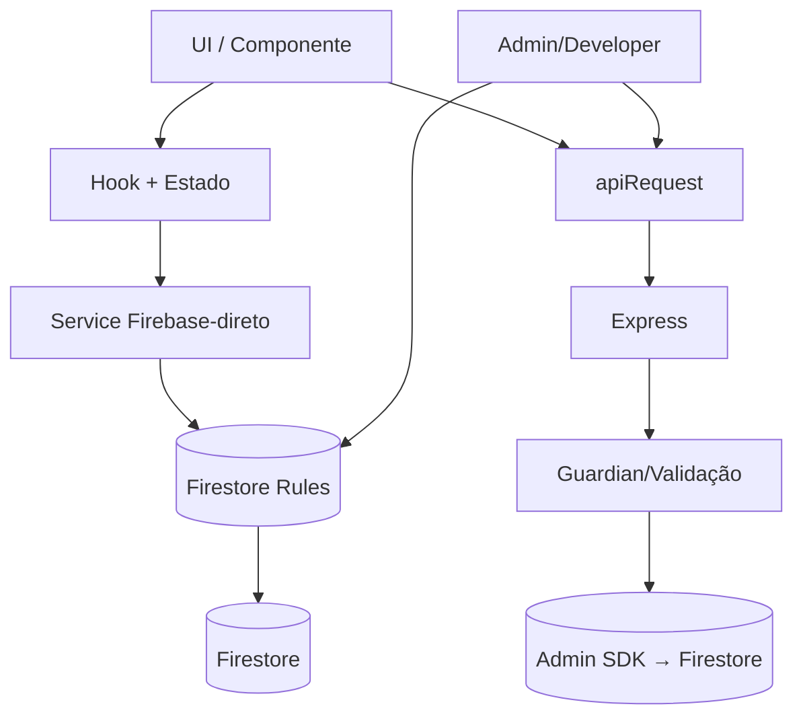

# INVENTÁRIO TÉCNICO MASTER — FLOW WEB
**Documento oficial do estado REAL da aplicação. Baseado somente em análise do repositório em 05/09/2026. Nada aqui foi inventado.**

- Repositório: `dresbach-records/flow-web` · Branch: `main` · HEAD: `64b988c`
- Diretório: `F:\Flow\flow-web`
- Vocabulário de status: **IMPLEMENTADO** · **PARCIALMENTE IMPLEMENTADO** · **VISUAL / SEM INTEGRAÇÃO** · **NÃO IMPLEMENTADO** · **IMPLEMENTADO COM ERRO** · **NÃO FOI POSSÍVEL DETERMINAR**

---

## 1. RAIZ DO PROJETO (arquivos e diretórios)

| Caminho | Finalidade | Status | Observações |
|---|---|---|---|
| `package.json` | App `flow-web@1.0.0`, scripts `dev/build/lint/typecheck/test/preview` | IMPLEMENTADO | `test` = `vitest run`; sem script eslint |
| `pnpm-lock.yaml` / `package-lock.json` / `bun.lock` | Lockfiles (3 gerenciadores) | IMPLEMENTADO | CI usa pnpm 10.32.1 `--frozen-lockfile` |
| `vite.config.ts` (+ `.js`/`.d.ts` gerados) | Vite + React + proxy `/api`→backend (dev) | IMPLEMENTADO | |
| `vitest.config.ts` | Escopo `src/**/*.test.ts`; exclui specs/backends | IMPLEMENTADO | |
| `playwright.config.ts` | E2E, baseURL `:3000`, webServer `pnpm dev` | IMPLEMENTADO | |
| `tsconfig.json` | ES2020, strict, `resolveJsonModule`, `noEmit`, react-jsx | IMPLEMENTADO | Sem `noUnusedLocals` |
| `index.html` | Metadata/SEO/OG/Twitter/JSON-LD/icons | IMPLEMENTADO | + robots + canonical |
| `firestore.rules` | 21 paths, mínimo privilégio | IMPLEMENTADO | Sem `allow ... if true` produtivo |
| `storage.rules` / `firebase.json` | Regras de Storage / deploy config | IMPLEMENTADO | Conteúdo do Storage não auditado além das regras |
| `vercel.json` | Fallback SPA `/(.*)`→`/index.html` | IMPLEMENTADO | `/api` em prod = backend absoluto (documentado) |
| `.env` / `backend/.env` | Secrets locais (gitignored) | IMPLEMENTADO | **NÃO versionados** |
| `.env.example` / `backend/.env.example` | Templates (inclui doc da Fase 2) | IMPLEMENTADO | |
| `src/` | Frontend (305 arquivos) | IMPLEMENTADO | Ver §4 |
| `backend/` | API Express (15 arq. em `src`) | IMPLEMENTADO | Ver §16 |
| `public/` | Assets + catálogos + PWA | IMPLEMENTADO | Ver §28 |
| `docs/` | 12 docs + `INVENTARIO_350_TELAS.{json,csv,md}` | IMPLEMENTADO | |
| `tests/` | `flow-smoke.spec.ts` (Playwright) | IMPLEMENTADO | Specs antigas removidas |
| `.github/workflows/` | `ci.yml` (front lint/test/build + backend test/build), `playwright.yml` | IMPLEMENTADO | |
| `temp_clone/` | Cópia obsoleta do repo **versionada (165 arquivos)** | IMPLEMENTADO COM ERRO | Bloat: remover do git (P2) |
| `capture_admin.mjs` / `debug_dom.mjs` | Scripts avulsos de debug Playwright | PARCIALMENTE IMPLEMENTADO | Sem script npm; uso manual |
| `metadata.json` / `flow-audit-report.txt` / `lista de pagina s da flow.txt` | Artefatos/rascunhos | VISUAL / SEM INTEGRAÇÃO | Não lidos por código |
| ESLint / Prettier / Tailwind / PostCSS / Docker | **Inexistentes** (glob vazio) | NÃO IMPLEMENTADO | Lint = `tsc -b` |

---

## 2. ÁRVORE DO PROJETO

```text
flow-web/
├── src/                    # 305 arquivos (125 .ts, 121 .tsx, 58 .css, 1 .md)
│   ├── App.tsx             # roteador manual + lazy + ModuleGate
│   ├── main.tsx            # bootstrap, tema light, SW, OfflineNotice, InstallAppPrompt
│   ├── app/                # páginas: Auth, SocialFeed, Profile, Creator, Schedule,
│   │                       # PlatformModules, memorial/, modules/ (8), commerce/, rewards/
│   ├── components/         # 11 domínios (auth, creator, layout, moderation, navigation,
│   │                       # profile, schedule, site, social, system, ui)
│   ├── layouts/            # AppLayout, Sidebar, Topbar, BottomNav, FloatingPlayer (legado)
│   ├── hooks/              # 7 hooks
│   ├── contexts/           # AppContext, PlayerContext
│   ├── services/           # api, firebase (18 arq.), ads/backend/commerce/identity/moderation/rewards
│   ├── developer/          # Painel Developer (App + 5 páginas + css)
│   ├── admin/              # AdminApp, ModuleCenter, SiteEditor, components/, pages/ (16)
│   ├── core/modules/       # ModuleRegistry
│   └── styles/             # index.css (entry)
├── backend/src/            # 15 arquivos: main, config, domain, application, infrastructure, services
├── backend/tests/          # domain.test.ts
├── public/                 # catálogos, icons, manifest, sw.js, logos
├── docs/                   # inventários + auditorias + TODO (especificação)
└── tests/                  # flow-smoke.spec.ts
```

---

## 3. ESTATÍSTICAS

- `src`: **305 arquivos** = 125 `.ts` + 121 `.tsx` + 58 `.css` + 1 `.md`
- Linhas TS/TSX em `src`: **16.516**
- Buckets: **≤300: 238** · **301–600: 7** · **601–1000: 1** (`AuthPage.tsx`, 704) · **>1000: 0**
- Top maiores: AuthPage 704 · SettingsModule 584 · AdminDashboard 463 · ShortsModule 451 · firebase/auth 430 · MessagesModule 386 · ExploreModule 324 · CreatePostModal 317 · CommunitiesModule 288 · App.tsx 280
- Backend `src`: 15 arquivos
- Hooks: 7 · Contexts: 2 · Firebase services: 18 arquivos · Services não-Firebase: 10 arquivos
- Componentes (pastas em `components/`): 11 domínios, ~45 pastas de componente
- Admin pages: 16 · Memorial screens: 15 · Developer páginas: 5
- Testes: 3 unit (18 casos) + 1 E2E (4 casos) + 1 backend
- Rotas app: ~35 padrões (ver §8) · Admin: 20 ids · Developer: 6

---

## 4. FRONTEND — MAPA POR CAMADA

| Camada | Onde | Status |
|---|---|---|
| Roteador manual (`pushState`+`popstate`, títulos por rota) | `src/App.tsx` | IMPLEMENTADO |
| Code-splitting (`React.lazy` em 16 rotas + Suspense) | `src/App.tsx` | IMPLEMENTADO |
| Gate de manutenção por módulo | `ModuleGate` + `src/hooks/useModuleStates.ts` | IMPLEMENTADO |
| Layout canônico (AppShell/Sidebar/Topbar/RightRail/PageContainer) | `src/components/layout/*` | IMPLEMENTADO |
| Layouts legados (AppLayout/Sidebar/Topbar/BottomNav/FloatingPlayer) | `src/layouts/` | IMPLEMENTADO (em uso pelo AppShell) |
| Auth/consentimento | `AuthPage`, `TermsGate`, `AppContext`, `services/firebase/{auth,consent}.ts` | IMPLEMENTADO |
| Módulos sociais | `src/app/modules/` (8) + `src/components/social/*` | IMPLEMENTADO |
| Admin | `src/admin/` (5 componentes + 16 páginas) | IMPLEMENTADO |
| Developer | `src/developer/` | IMPLEMENTADO |
| Memorial | `src/app/memorial/` (15 telas) | IMPLEMENTADO (persona do catálogo = contexto) |
| Commerce/rewards (políticas puras + testes) | `src/app/commerce/*.ts`, `src/app/rewards/` | PARCIALMENTE IMPLEMENTADO (UI de loja = PENDENTE) |
| PWA global | `main.tsx` + `OfflineNotice` + `InstallAppPrompt` | IMPLEMENTADO |
| Stores Redux/Zustand, repositories/, adapters/ | — | NÃO IMPLEMENTADO (estado = hooks + contexts) |

---

## 5. PÁGINAS DA APLICAÇÃO

| Nome | Arquivo | Rota | Módulo | API/Backend/Firebase | Estados | Status |
|---|---|---|---|---|---|---|
| SiteHome | `src/app/SiteHome.tsx` | `/` + fallback não-`/app` | site | communities/newsletter/stats reais | honestos | IMPLEMENTADO |
| AuthPage (17 modos) | `src/app/AuthPage.tsx` | 17 rotas `/login…/central-contas` | auth | Firebase Auth; reset via oobCode; SMS/código = erro honesto | loading/erro/sucesso | IMPLEMENTADO (SMS/TOTP-app PENDENTE) |
| SocialFeed | `src/app/SocialFeed.tsx` | `/app` (+`/app/criar`) | feed | `usePosts` + like/save + stories reais | loading/erro/vazio | IMPLEMENTADO |
| Explore | `ExploreModule.tsx` | `/app/explorar` | explore | posts reais + like real | loading/erro/vazio | IMPLEMENTADO |
| Shorts | `ShortsModule.tsx` | `/app/shorts` | shorts | vídeos reais + like/save/follow | loading/erro/vazio | IMPLEMENTADO |
| Messages | `MessagesModule.tsx` | `/app/mensagens` | messaging | conversations/messages reais | loading/erro/vazio | IMPLEMENTADO |
| Notifications | `NotificationsModule.tsx` | `/app/notificacoes` | notifications | coleção própria + fan-out | loading/erro/vazio | IMPLEMENTADO |
| Communities | `CommunitiesModule.tsx` | `/app/comunidades` | communities | join/leave reais | loading/erro/vazio | IMPLEMENTADO |
| Saved | `SavedModule.tsx` | `/app/salvos` | saved | `users/{uid}/saved` + posts | loading/erro/vazio | IMPLEMENTADO |
| Settings | `SettingsModule.tsx` | `/app/configuracoes` | settings | perfil/prefs/2FA/backup-codes reais | loading/erro/sucesso | IMPLEMENTADO |
| Profile | `src/app/ProfilePage.tsx` | `/app/perfil`, `/app/perfil/:id` | perfil | `useProfile` + follow real | loading/erro/vazio | IMPLEMENTADO |
| CreatorCenter | `src/app/CreatorCenter.tsx` | `/app/criador*` | creator | stats reais; views "—" | honestos | IMPLEMENTADO |
| ScheduleCenter | `src/app/ScheduleCenter.tsx` | `/app/agendamento*` | schedule | `scheduling.ts` real | — | IMPLEMENTADO |
| PlatformModules | `src/app/PlatformModules.tsx` | shop/loja/pedidos/rewards/ads/report/safety | commerce | Report real; demais PENDENTE honesto | honestos | PARCIALMENTE IMPLEMENTADO |
| MemorialModule | `src/app/memorial/MemorialModule.tsx` | `/memorial*`, `/app/memorial*` | memorial | requests/tributes/legado reais | honestos | IMPLEMENTADO |
| AdminApp | `src/admin/AdminApp.tsx` | `/admin*` | admin | Firestore + rules + audit | loading/erro/vazio | IMPLEMENTADO |
| DeveloperApp | `src/developer/DeveloperApp.tsx` | `/developer*` | developer | `/meta` + diagnostics + audit | loading/erro/vazio | IMPLEMENTADO |

---

## 6. SUBPÁGINAS / SUBROTAS / MODAIS

- Memorial telas 351–365 (15, ver §13) — IMPLEMENTADO (núcleo funcional) / persona 352 = contexto do catálogo
- Auth: 17 modos na mesma página (login, cadastro, recuperar, redefinir via oobCode, verificar e-mail/telefone, confirmação, 2FA ×3, sessões, bloqueada/desativada/suspensa, central) — IMPLEMENTADO (SMS/código = PENDENTE honesto)
- Settings: 5 abas (perfil, segurança, privacidade, notificações, legado) — IMPLEMENTADO
- Creator: 4 abas (overview, posts, followers, income honesto R$ 0,00) — IMPLEMENTADO
- Modais reais: `CreatePostModal` (publicar), `CommentsPanel`, `ReportDialog` (denúncia backend), `CreatorCreateModal` — IMPLEMENTADO
- Drawers/wizards independentes: NÃO IMPLEMENTADO (nada no código exige)

---

## 7. ROTAS — MAPA E SAÚDE

- Site/auth: `/`, 17 AUTH_ROUTES, `/memorial*`, `/configuracoes/memorial`, `/developer*`, `/admin*`, fallback não-`/app` → SiteHome
- `/app/*`: explorar, shorts, mensagens, notificacoes, comunidades, salvos, configuracoes, memorial*, perfil, perfil/:id, agendamento(s), criador*, shop/loja, pedidos, rewards, anunciar/ads, denunciar, seguranca; default → SocialFeed
- Navegação manual (`history.pushState`); sem react-router (decisão arquitetural, funcional)
- Auth: `/app*` exige login (redirect `/login`); consentimento obrigatório bloqueia app
- Admin: sessão Firebase + papel (admin/moderator); Developer: só admin; módulos sensíveis com `PermissionGuard`
- Rotas duplicadas: não detectadas. Rotas sem página: `marketplace/eventos` (admin) → PENDENTE honesto. Links quebrados: nenhum detectado (footer/header → rotas reais ou SiteHome)
- Playwright comprova: `/` título FLOW; `/app` sem sessão → `/login`

---

## 8. COMPONENTES (domínios → status)

| Domínio | Componentes | Reutilização | Status |
|---|---|---|---|
| layout | AppShell, Sidebar, Topbar, RightRail, PageContainer (+layouts legados) | alta (todas as telas) | IMPLEMENTADO |
| ui | EmptyState, ErrorState, LoadingState, UserAvatar, OfflineNotice | alta | IMPLEMENTADO |
| auth | AuthLayout, TermsGate | média | IMPLEMENTADO |
| social | PostCard, PostComposer, FeedTabs, StoriesRail, CommentsPanel | alta | IMPLEMENTADO |
| profile | ProfileHeader, ProfileTabs, ProfilePostCard | média | IMPLEMENTADO |
| schedule | ScheduleCalendar/Composer/Details/List | média | IMPLEMENTADO |
| creator | 8 + types + data (ações de menu) | média | IMPLEMENTADO |
| site | 14 (Header, Hero, Features, Communities, Newsletter, Stats, Footer, InstallAppPrompt…) | alta | IMPLEMENTADO |
| moderation | ReportDialog (montado no PostCard) | baixa (1 uso) | IMPLEMENTADO |
| system | AppErrorBoundary | global | IMPLEMENTADO |
| navigation | BottomNav via layouts (duplicata removida) | — | IMPLEMENTADO |
| Duplicados restantes | nenhum detectado | — | — |

---

## 9. CSS

- 58 arquivos CSS; padrão: CSS junto ao componente (`Component/Component.css`) — IMPLEMENTADO
- Global: `styles/index.css` (entry), tokens — IMPLEMENTADO
- `!important`: **12** ocorrências (`profile-page.css` 5, `ProfileHeader.css` 3, `flow-brand.css` 3, `responsive.css` 1) — dívida P3
- Dark mode: **0 resíduos** (`data-theme` fixo `light`) — IMPLEMENTADO
- Cores hardcoded fora de tokens: presentes pontualmente (estilos inline) — P3
- CSS morto: `social-reference.css` **removido** nesta auditoria

---

## 10. LAYOUT GLOBAL / RESPONSIVO

- AppShell: Topbar 64px + Sidebar + conteúdo + RightRail opcional + BottomNav mobile — IMPLEMENTADO
- Breakpoints: shell Developer 860px; tabelas admin com containers de scroll; E2E comprova **0 overflow em 390px e 1440px na Home** — PARCIALMENTE IMPLEMENTADO (device-lab 12 larguras NÃO executado)
- Mobile ≠ app separada (mesma base) — IMPLEMENTADO
- Problemas abertos de z-index/sticky: nenhum registrado

---

## 11. SITE PÚBLICO

Home componentizada (Hero, Features, Benefits, Communities real, Stats reais, Newsletter real, Download, Footer) — botões → `/login`, `/cadastro`, rotas reais. Páginas institucionais além da Home: servidas pela Home (fallback) — PARCIALMENTE IMPLEMENTADO (conteúdo por página no `SiteEditor`, vinculação viva = Fase 9). SEO: title/desc/viewport/theme/robots/canonical/OG/Twitter/JSON-LD/favicon — IMPLEMENTADO.

---

## 12. REDE SOCIAL — FLUXOS E2E REAIS

Cadastro→Login→Consentimento→`/app` · Postar (texto/mídia) · Curtir/salvar/comentar (otimista+reversão) · Denunciar (backend) · Seguir + fan-out · Mensagens · Comunidades · Shorts · Salvos · Perfil · 2FA backup-codes · Recurso de conta (appeals). **Todos IMPLEMENTADO** (SMS/TOTP-app/chamadas/anexos = PENDENTE honesto).

---

## 13. ADMIN (16 páginas +fundação)

Dashboard, Usuários, Moderação, Conteúdo, Comunidades, Mensagens, Notificações, Memorial, RH, Relatórios, Sistema, Suporte, Logs, Analytics, Configurações, Segurança + ModuleCenter + SiteEditor. Auth só Firebase+papel; `PermissionGuard`; auditoria em ações sensíveis; marketplace/eventos = PENDENTE honesto. **IMPLEMENTADO** (escopo real).

## 14. RH

`/admin/rh`: diretório real (users), gestão de papéis (update real + audit), contagens por papel. Recrutamento/desempenho/treinamentos/benefícios/folha: **NÃO IMPLEMENTADO** (exigem backend próprio; sem telas fictícias).

## 15. DEVELOPER (`/developer`, só admin)

Dashboard (`/meta` + counts), APIs explorer + tester real (ID token, bloqueio de URLs externas), Firebase & Sistema (diagnostics + alcance por coleção), Logs (audit), Ambientes (presença, sem valores), Docs (contrato vivo + matriz). Filas/webhooks/OTel/deploys: **NÃO IMPLEMENTADO** (sem backend; sem telas fictícias).

## 16. BACKEND (`backend/src`, 15 arquivos)

| Camada | Arquivos | Status |
|---|---|---|
| Routes/controller (Express) | `main.ts` (8 rotas) | IMPLEMENTADO |
| Services | auth, content, persona, report (validado), scheduler | IMPLEMENTADO |
| Application/Domain | guardian use-case, feature-flag, moderation-result | IMPLEMENTADO |
| Infrastructure | database, firebase-admin, gemini-adapter, firestore-moderation repo | IMPLEMENTADO |
| Config | `env.ts` (zod) | IMPLEMENTADO |
| Seed | `seed-marina.ts` | IMPLEMENTADO (não executado em CI) |

Auth do backend: `register` cria via Admin SDK; `login` delega ao client Firebase (documentado). Guardian desabilitado por padrão (`FLOW_GUARDIAN_ENABLED=false`).

## 17. APIS (contrato real — fonte: `GET /api/v1/meta`)

| Método | Endpoint | Auth | Validação | Consumidor | Status |
|---|---|---|---|---|---|
| GET | `/health` | não | — | AdminSistema, Dashboard, Developer | IMPLEMENTADO |
| GET | `/api/v1/meta` | não | — | Developer | IMPLEMENTADO |
| POST | `/api/v1/auth/register` | não | service | backend interno | IMPLEMENTADO |
| POST | `/api/v1/auth/login` | não | — | backend interno | IMPLEMENTADO |
| GET | `/api/v1/feed` | não | mode | — (UI usa Firestore direto) | IMPLEMENTADO / NÃO UTILIZADO pela UI |
| POST | `/api/v1/posts` | não | Guardian | — (UI usa Firestore direto) | IMPLEMENTADO / NÃO UTILIZADO pela UI |
| POST | `/api/v1/posts/:id/like` | não | — | — | IMPLEMENTADO / NÃO UTILIZADO pela UI |
| POST | `/api/v1/reports` | não | campos obrigatórios | ReportDialog, memorial | IMPLEMENTADO |

## 18. FIREBASE

Auth (e-mail/Google/reset/oobCode), Firestore (21 paths de rules — ver matriz em `AUDITORIA_FINAL_FLOW.md`), Storage (uploads posts/tributes/memorial-docs), sem Functions, **0 `onSnapshot`** (leituras one-shot; sem leak de listeners), `require*` anti-nulo. Console restante: 8 `warn/error` diagnósticos (nenhum `log` como implementação).

## 19. BANCO (Firestore — coleções em uso)

`users` (+`following/followers/saved/notifications/security/2fa`), `posts` (+`likes/comments`), `communities` (+`members`), `users/{uid}/memberships`, `conversations` (+`messages`), `stories`, `reports`, `memorial_requests`, `tributes`, `appeals`, `newsletter`, `consents`, `scheduled_posts`, `platform_settings`, `site_pages`, `admin_audit`, `guardian_moderations`. Índices compostos: nenhum customizado necessário (queries evitam where+orderBy combinados, exceto `notifications` admin que usa `limit` sem ordenação).

## 20. AUTENTICAÇÃO / 21. CONSENTIMENTO

Ver `AUDITORIA_FINAL_FLOW.md` (seções AUTENTICAÇÃO e matriz de rules `consents`). Fluxo completo **IMPLEMENTADO**; IP do aceite pendente (user-agent registrado).

## 22. PWA

Manifest (192/512/maskable/favicon/Apple) · SW v3 (shell network-first; `/api` bypass; Firebase cross-origin intocado) · InstallAppPrompt · OfflineNotice · start_url `/app` · standalone. **IMPLEMENTADO**.

## 23. CATÁLOGO 350 TELAS (referência, não prova)

- `FLOW_CATALOGO_350_TELAS_DESKTOP_LIGHT`: **21 PNGs** · `FLOW_ADMIN_CATALOGO...`: **355 arquivos** · `Telas Versao mobili`: **14 arquivos** · SVGs em public: **706**
- `docs/INVENTARIO_350_TELAS.json`: **350 telas**, 16 módulos (Autenticação, Feed e publicações, Stories, Shorts, Perfil, Explorar e pesquisa, Mensagens, Notificações, Comunidades e grupos, Salvos e eventos, Marketplace, Páginas, Business Suite, Ads, Configurações, Segurança e moderação)
- Cobertura real: social/auth/admin/memorial/settings/Developer/site. Marketplace, Business Suite, Ads, Páginas, Events: **NÃO IMPLEMENTADO** como funcionalidade.

## 24. STATIC E MOCK — OCORRÊNCIAS (grep 05/09/2026)

- Palavras `mock/fake/DemoService/FakeRepository/placeholder.com/lorem`: **0 ocorrências funcionais** (só comentários "sem mocks").
- `unsplash/pravatar/mixkit`: **10 linhas** — `Screen352Profile.tsx` (14,47,60,99: persona do catálogo = contexto) + `HeroSection.tsx` (7–11,14: ilustração de marketing `aria-hidden`). Classificação: **VISUAL / SEM INTEGRAÇÃO** (permitido: editorial/ilustração).
- `alert(`: **0**. `onClick` vazio / `href="#"`: **0**. TODO/FIXME: **0** (matches anteriores eram "Todos").
- `setTimeout`: 15 usos, todos UI legítima (toast 3s, scroll 150ms, redirect pós-operação real, banner offline 4s) — **nenhum simula API**.
- `console.log` como implementação: **0**.

## 25. BOTÕES E INTERAÇÕES — TABELA

| Tela | Botão | Ação→Persistência | Status |
|---|---|---|---|
| Feed | Curtir/salvar/comentar/compartilhar/mais | Firestore / clipboard / ReportDialog→backend | IMPLEMENTADO |
| Shorts | like/save/follow/share | Firestore / clipboard | IMPLEMENTADO |
| Comunidades | Entrar/Participar | join/leave + contador | IMPLEMENTADO |
| Mensagens | Enviar | `conversations/{id}/messages` | IMPLEMENTADO |
| Composer | Localização | geolocalização real | IMPLEMENTADO |
| ModuleCenter | Manutenção/Ativar | `platform_settings/modules` + gate no app | IMPLEMENTADO |
| SiteEditor | Publicar/Pré-visualizar | `site_pages` + `window.open` real | IMPLEMENTADO |
| Admin | exportar/suspender/verificar/arquivar/decidir | Firestore + audit + CSV | IMPLEMENTADO |
| Developer tester | Executar | fetch real autenticado | IMPLEMENTADO |
| Marketplace/ads (app+admin) | — | — | PENDENTE honesto (desabilitado/ausente, sem fake) |

## 26. DEPENDÊNCIAS

| Gerenciador | pnpm 10.32.1 (CI `--frozen-lockfile`; exFAT exige `--node-linker=hoisted`) |
|---|---|
| deps | firebase 12.18.0 · lucide-react 1.39.0 · react+dom 19.2.8 |
| devDeps | playwright 1.62.1 · types/node 26.4.1 · react types · plugin-react 6.1.1 · sharp 0.35.4 · typescript 5.9.3 · vite 8.2.2 · **vitest 5.0.0** (adicionada e utilizada) |
| backend | express · firebase-admin · zod · helmet · cors · jsonwebtoken · argon2 · dotenv · @google/genai |
| Não utilizadas | nenhuma detectada |

## 27. ASSETS

Icons 192 (21 KB)/512 (117 KB) gerados do logo · `logo.png` · `flow.ico` · `flow-logo.svg` (1.580 B) · `flow-assets-svg` (light 318 B — **0 bytes? NÃO**: 318 B válidos) · `maria-silva-imagens/` (seed persona) · `baner home.png` (uso no site — NÃO FOI POSSÍVEL DETERMINAR sem grep; consta no public). Fontes via Google Fonts (Outfit/Plus Jakarta).

## 28. TESTES

| Grupo | Onde | Qtd | Status |
|---|---|---|---|
| Unit frontend | `src/app/commerce/__tests__/` (3 arq.) | 18 casos | PASS (`pnpm test`) |
| E2E | `tests/flow-smoke.spec.ts` | 4 casos (chromium, servidor real) | PASS |
| Backend domain | `backend/tests/domain.test.ts` | asserts produto/proteção | PASS (`npm test`) |
| CI | `ci.yml` (front lint/test/build + backend test/build) + `playwright.yml` | — | config IMPLEMENTADO (execução remota NÃO FOI POSSÍVEL DETERMINAR) |

## 29. ERROS ATUAIS

- CRÍTICO: **0**. ALTO: **0**.
- MÉDIO: (1) `.env` local com API apontando ao próprio frontend — ação do operador; (2) bootstrap admin exige `role:'admin'` manual.
- BAIXO: (1) `!important` ×12; (2) vendor Firebase ~497 kB; (3) `temp_clone/` versionado; (4) device-lab além de 390/1440 não executado.

## 30. ARQUIVOS ÓRFÃOS

Verificação por importadores: **nenhum órfão funcional**. Removidos nesta auditoria: `FlowPostCard`, `StoryStrip`, `BottomNavigationBar`, `services/api/feed.ts`, `social-reference.css`, `CommerceHub`, `ShopOrderCenter`, `FlowWeb`, specs antigas. `vite-env.d.ts` (ambient, normal). Barrels (`services/*`, `components/*/index.ts`) consumidos.

## 31. ARQUIVOS MONOLÍTICOS

Nenhum >1000 linhas. Maiores e decomposição: `AuthPage.tsx` 704 (17 modos; extrair formulários por modo — P3) · `SettingsModule.tsx` 584 (5 abas; extrair abas — P3) · `AdminDashboard.tsx` 463 (ok) · `ShortsModule.tsx` 451 (ok) · `firebase/auth.ts` 430 (ok, coeso). Nada bloqueante.

## 32–35. MATRIZES

Ver `AUDITORIA_FINAL_FLOW.md` (matrizes de funcionalidades, rules, APIs). Componentes: todos com CSS próprio e uso mapeado no §8 (reutilizáveis: layout/ui/social/site; uso único: ReportDialog, AdminLogin).

## 36. MATRIZ BACKEND

| Funcionalidade | Endpoint | Controller/UseCase/Repo | Banco | Consumidor | Status |
|---|---|---|---|---|---|
| Health/meta | GET | `main.ts` direto | — | Developer/Admin | IMPLEMENTADO |
| Auth bootstrap | POST ×2 | `auth.service` + Admin SDK | users | interno | IMPLEMENTADO |
| Feed/posts/like | GET/POST ×3 | `content.service` + Guardian | posts | Developer tester | IMPLEMENTADO / UI usa Firestore direto |
| Reports | POST | `report.service` validado | reports | ReportDialog, memorial | IMPLEMENTADO |
| Scheduler | job 60s | `scheduler.service` | posts/scheduled | interno | IMPLEMENTADO |
| Comunidades/mensagens/notificações via Express | — | — | — | — | NÃO IMPLEMENTADO (UI usa Firestore+rules = backend real da arquitetura) |

## 37. O QUE FOI CRIADO (neste ciclo)

Frontend: 7 services Firebase, 7 páginas admin, Developer (7 arq.), OfflineNotice, InstallAppPrompt, useModuleStates, PermissionGuard, ReportDialog funcional, 3 suites de teste, smoke E2E. Backend: `/meta`, validação reports, CORS multi. Firebase: 8 novos paths de rules. PWA: SW v3, metadata. Docs: `AUDITORIA_FINAL_FLOW.md` + este inventário.

## 38. IMPLEMENTADO / 39. PARCIAL / 40. NÃO IMPLEMENTADO / 41. VISUAL

- **§38:** social completo, admin 18 áreas, Developer, memorial funcional, auth+consentimento, PWA, testes+CI, backend 8 rotas.
- **§39:** PlatformModules (Report real; loja PENDENTE), Stories (leitura real; criação PENDENTE), RH (diretório real; tático PENDENTE), Site (Home real; binding do editor PENDENTE), notificações admin (somente-leitura; disparo PENDENTE).
- **§40:** marketplace/seller/orders/ads/rewards/events (app+admin), SMS/TOTP-app/Apple, chamadas/anexos, séries históricas, recrutamento/desempenho/treinamentos/benefícios/folha, filas/webhooks/OTel/deploys, Functions, react-router (decisão: roteador manual).
- **§41:** persona memorial (contexto), Hero marketing, Safety/policy, FAQ memorial, contrato (documento real versionado).

## 42. MOCK/STATIC — lista final

Zero funcional. Ver §24 (10 linhas ilustrativas classificadas).

## 43. BACKLOG (P0–P3)

- **P0:** operador corrigir `VITE_API_BASE_URL` + conceder `role admin` + deploy das rules.
- **P1:** backend comércio (marketplace/orders/rewards) · provedor SMS · TOTP-app.
- **P2:** `temp_clone/` fora do git · séries históricas · criação de stories · binding SiteEditor→Home · fan-out broadcast · tático RH.
- **P3:** `!important` ×12 · decompor AuthPage/SettingsModule · device-lab completo.

## 44. DEPENDÊNCIAS ENTRE FUNCIONALIDADES

Cadastro → Login → Consentimento → Sessão → Perfil → Feed → Posts → Comentários → Notificações(fan-out) → Moderação(admin) → Auditoria. Quebra em qualquer elo bloqueia o seguinte (verificado no código).

## 45. FLUXOS E2E (existem de verdade)

Cadastro→Auth→perfil→consentimento→login→feed→post→Firestore→like→notificação; denúncia→backend→fila admin→decisão→audit; memorial solicitação→protocolo→acompanhamento→decisão admin; módulo manutenção→gate no app; site publish→`site_pages`.

## 46. SEGURANÇA

Mínimo privilégio (matriz §18 AUDITORIA); sem secrets no frontend; CORS restrito; backend valida; PermissionGuard + rules (frontend nunca é única proteção); PWA sem cache privado. Problema: nenhum (além do P0 operacional).

## 47. PERFORMANCE

Split por rota (chunks medidos no build 05/09); vendor Firebase 497 kB; **0 listeners** (`onSnapshot` ausente); sem paginação nas listas (limites 20–100; paginação real = P2).

## 48. ARQUITETURA

**ATUAL (real):** SPA React + roteador manual + contexts + services Firebase-direto (CRUD sob rules) + Express para sistema/moderação/scheduler + Admin SDK. Sem data-layer adicional, sem router lib, sem store global.
**RECOMENDADA (quando escalar):** paginação/cursores, react-query ou equivalente, Functions para fan-out broadcast, testes de componente. Nada disso existe hoje — registrado, não alegado.

## 49. DIAGRAMA


