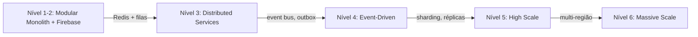

# FLOW — ENGINEERING MASTER PLAN

> Documento central de engenharia da FLOW. Explica **o que é**, **como funciona**, **como os dados circulam** e **como evoluir** para uma rede social de grande escala **sem reescrever o sistema**.
>
> Última revisão: 2026-09-05 · Status: **vivo** · Complementa `docs/architecture/00-MASTER-ARCHITECTURE.md`.

---

## 1. O que é a FLOW

Rede social brasileira ("Conecte. Compartilhe. Viva.") implementada como **SPA responsiva** (React 19 + Vite + TypeScript) com **PWA**, **Firebase** como infraestrutura central e **backend Express** complementar.

Princípios inegociáveis:
- **Zero mock / zero static funcional** — a UI sempre reflete o estado real.
- **Regra de conclusão** — nada é "concluído" sem fluxo ponta-a-ponta (UI → service → persistência → autorização → estados → testes).
- **Nunca confiar no frontend** — autorização real nas Firestore Rules e no backend.
- **Não copiar** implementações proprietárias; usar benchmarks arquiteturais públicos (Meta/TAO/News Feed) apenas como referência de maturidade.

## 2. Como está estruturada

```
┌──────────────────────────────────────────────────────────────┐
│                        CLIENTE (Browser)                     │
│  SPA React (src/) ── roteador manual + ModuleGate + TermsGate │
│  ┌────────────────────────────────────────────────────────┐  │
│  │  Páginas (src/app, src/admin, src/developer)           │  │
│  │    └─ Componentes (src/components)                     │  │
│  │         └─ Hooks/Contextos (src/hooks, src/contexts)   │  │
│  │              └─ Services (src/services) ← fronteira    │  │
│  └────────────────────────────────────────────────────────┘  │
│  Service Worker (sw.js) · Manifest · BottomNav · PWA         │
└───────────────┬──────────────────────────┬───────────────────┘
        Firebase SDK                fetch /api (Bearer ID token)
                │                            │
┌───────────────▼──────────────────┐  ┌──────▼──────────────────┐
│      FIREBASE (infra central)    │  │    BACKEND EXPRESS      │
│  Auth · Firestore · Storage ·    │  │  (backend/src)          │
│  Analytics · Rules · Indexes     │  │  notify, push, contact, │
└──────────────────────────────────┘  │  reports, feed,         │
                                      │  guardian (Gemini),     │
                                      │  scheduler, metrics     │
                                      └─────────────────────────┘
```

### Camadas de código
| Camada | Local | Regra |
|---|---|---|
| Páginas | `src/app`, `src/admin`, `src/developer` | compõem componentes; nunca acessam Firestore direto |
| Componentes | `src/components/<dominio>/<Component>/` | reutilizáveis; padrão `.tsx + .css + .types.ts + index.ts` |
| Hooks | `src/hooks` | encapsulam lógica de feature |
| Contextos | `src/contexts` | estado global (auth/consent, player) |
| Services | `src/services` | **única fronteira de integração** (Firebase/API) |
| Domínio puro | `src/app/commerce`, `src/core` | regras de negócio testáveis, sem dependência externa |

## 3. Como os dados circulam

### Leitura (padrão)
```
UI → Hook → Service (firebase) → Firestore Rules (autorização) → Firestore → UI (estado)
```
Exemplo: Feed → `usePosts` → `listDocumentsPage('posts')` → rules (autenticado) → posts + autores → ranking → UI.

### Escrita (padrão)
```
UI → Service → regras (owner/admin) → Firestore → fan-out opcional (notify)
```
Exemplo: Like → `toggleLike` → transação (likes + counter) → `POST /api/v1/notify` (fallback Firestore).

### Operações privilegiadas (backend)
```
UI → apiRequest → Express → requireAuth/requireAdmin → serviço → Firestore (Admin SDK)
```
Exemplos: contato, denúncia, notificação+push, moderação Guardian, agendamento.

## 4. O grafo social

Implementado como **entidades + associações** (padrão TAO-like) no Firestore:

- `users/{uid}/following/{tid}` + `users/{tid}/followers/{uid}` (follow bidirecional)
- `posts/{id}/likes/{uid}` (like, transação)
- `posts/{id}/comments` (comentários com `parentId`)
- `communities/{id}/members/{uid}` + `users/{uid}/memberships/{cid}`
- `users/{uid}/blocks/{tid}`, `users/{uid}/saved/{postId}`
- `conversations` + `messages` (mensagens privadas)
- `events/{id}/rsvps/{uid}`, `reports`, `tributes`

Planejado: menções, repost persistente, amizade (decisão), páginas, marketplace.

## 5. Feed e ranking

- **Hoje**: cronológico com cursor + ranking client-side (recência, afinidade, engajamento, diversidade, bloqueados). Backend `GET /api/v1/feed` com cache 15s.
- **Amanhã**: ranking server-side → recomendação personalizada (sem ML fake).

## 6. Mensagens e notificações

- **Mensagens**: Firestore realtime (`onSnapshot`), read receipts, admin read-only.
- **Notificações**: fan-out best-effort (`/api/v1/notify` → fallback Firestore) + push Web (VAPID) + preferências.
- **Evolução**: filas assíncronas para fan-out (evita perda em escala).

## 7. Moderação e segurança

- **3 camadas**: denúncia (comunitária) → fila admin (humana) → Guardian (IA, opt-in).
- **RBAC**: `user | creator | seller | moderator | admin`; proteção real nas rules + `requireAdmin`.
- **2FA**: backup codes reais; SMS/TOTP planejados.
- **LGPD**: consentimento versionado, exportação, auditoria.

## 8. Admin e Developer

- `/admin`: RBAC, auditoria (`admin_audit`), fila de moderação, gestão de usuários, feature flags, site editor, relatórios, health.
- `/developer`: metas, rotas de API, logs, diagnóstico (só admin).

## 9. PWA / Mobile

- Manifest, SW (`flow-shell-v3`, network-first, `/api` nunca cacheado), push, install, bottom nav.
- Uma única base responsiva (desktop e mobile).

## 10. Observabilidade

- Logs estruturados (`x-request-id`), health, métricas backend, auditoria, analytics GA4.
- OTel/tracing: planejado.

## 11. Como escalar (sem reescrever)



Ordem de extração (cada passo justificado): **cache (Redis)** → **filas/workers** → **feed/notify/search** → **data warehouse** → **multi-região**.

## 12. Como evoluir o produto (roadmap resumido)

- **FASE 9 (agora):** 350 telas funcionais — marketplace/events/rewards/ads com backend.
- **FASE 11:** operacional (deploy backend, backup, env), filas, Redis, push robusto, marketplace, paginação.
- **FASE 12:** ranking server-side, busca indexada, realtime, observabilidade, analytics.
- **FASE 13+:** DR drills, feature flags, ML/recomendação, escala massiva.

Detalhe completo: `docs/architecture/45-ROADMAP.md`.

## 13. Como uma equipe nova entende e evolui a FLOW

1. Leia este documento e o `00-MASTER-ARCHITECTURE.md`.
2. Use os catálogos (36–42) para localizar telas/componentes/APIs/coleções/eventos/permissões.
3. Use o `35-DEVELOPER-HANDBOOK.md` para o fluxo de trabalho.
4. Consulte `44-GAP-ANALYSIS.md` e `43-TECHNICAL-DEBT.md` para o que falta.
5. Alterações arquiteturais relevantes → ADR em `docs/architecture/adr/`.
6. Nunca violar: zero mock, regra de conclusão, camada de services, autorização real, Firebase preservado.

## 14. Estado atual em números

- Frontend: ~332 arquivos em `src/`.
- Backend: Express com 14 rotas, Guardian, scheduler, notify/push.
- Firestore: ~28 coleções raiz + 13 subcoleções, 22+ regras min-privilege.
- Testes: 18 unit (vitest) + 4 E2E (Playwright) + domínio backend.
- Catálogo: 350 telas desktop (16 módulos) + 350 telas admin (referência visual) + 14 mockups mobile.
- Componentes: ~49.
- Auditoria final: lint/test/build/E2E verdes; risco médio (env + role admin).

## 15. Critério de aceitação (como saber que o objetivo foi cumprido)

Uma equipe de engenharia, sem depender da memória do desenvolvedor original, deve conseguir entender — a partir desta documentação:
COMO A FLOW FUNCIONA HOJE · COMO OS DADOS CIRCULAM · COMO FRONTEND↔BACKEND SE COMUNICAM · COMO O FIREBASE PARTICIPA · COMO O GRAFO FUNCIONA · COMO FEED/MENSAGENS/NOTIFICAÇÕES/MODERAÇÃO/ADMIN/PWA FUNCIONAM · COMO SEGURANÇA E PRIVACIDADE FUNCIONAM · COMO OBSERVAR · COMO TESTAR · COMO FAZER DEPLOY · COMO RECUPERAR DE FALHAS · COMO ESCALAR · **E COMO EVOLUIR SEM REESCREVER O SISTEMA INTEIRO.**