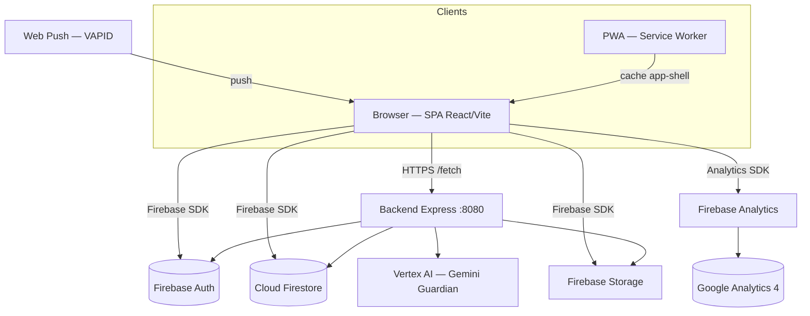
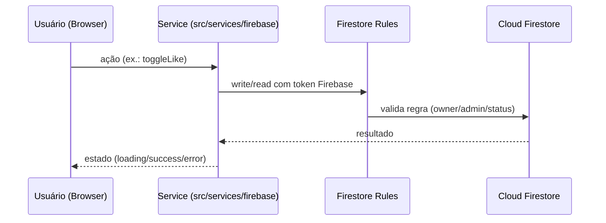
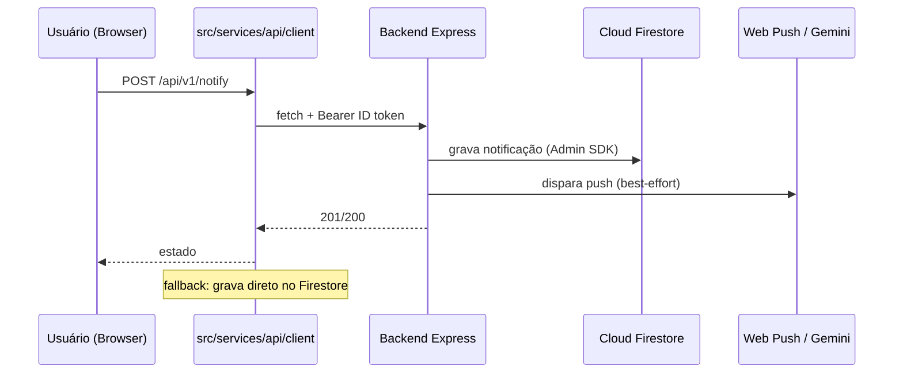

# FLOW — MASTER ARCHITECTURE

> **Documento central de arquitetura e engenharia da FLOW.**
> Status: **vivo** — deve ser atualizado sempre que a arquitetura mudar.
> Última revisão: 2026-09-05

---

## 1. O que é a FLOW

A FLOW é uma plataforma de rede social brasileira ("Conecte. Compartilhe. Viva.") construída como uma **aplicação web responsiva** (SPA em React + Vite), com:

- **Frontend:** React 19, TypeScript, Vite, CSS por componente, roteador manual (history API), code-splitting por rota.
- **Persistência e auth:** Google Firebase (Authentication, Cloud Firestore, Storage, Analytics).
- **Backend complementar:** Express (Node.js) com Firebase Admin SDK para notificações push, moderação por IA (Guardian/Gemini), agendador, relatórios, contato, métricas e auditoria de storage.
- **PWA:** manifest + service worker (`flow-shell-v3`) com estratégia network-first e fallback SPA.
- **Painel administrativo** (`/admin`) e **painel de desenvolvedor** (`/developer`) com regras de RBAC reais no Firestore.

O projeto opera sob a **"REGRA DE CONCLUSÃO FLOW"**: nenhuma funcionalidade é considerada concluída sem fluxo ponta-a-ponta real (UI → service → persistência → autorização → estados → testes). **Zero mock, zero static funcional.** O que não está implementado é exibido como estado vazio honesto, nunca como dado falso.

---

## 2. Benchmarks de referência

A FLOW usa conceitos arquiteturais **publicamente documentados** da Meta como benchmark de maturidade, sem copiar código, identidade visual ou implementação proprietária:

| Referência pública | Conceito aplicado/aspiração na FLOW |
|---|---|
| [TAO — The Associations and Objects](https://engineering.fb.com/2013/06/25/core-infra/tao-the-power-of-the-graph/) | Grafo social como entidades + associações (ver `08-SOCIAL-GRAPH.md`) |
| [News Feed Ranking](https://engineering.fb.com/2021/01/26/core-infra/news-feed-ranking/) | Feed cronológico atual → ranking client-side → ranking server-side (ver `09/10`) |
| [Graph Search](https://engineering.fb.com/2013/03/14/core-infra/under-the-hood-indexing-and-ranking-in-graph-search/) | Busca por índice/ranking futuros (ver `11-SEARCH-ARCHITECTURE.md`) |
| [Posts Search](https://engineering.fb.com/2013/10/24/core-infra/under-the-hood-building-posts-search/) | Indexação de posts futura |
| [Inside Facebook's video delivery](https://engineering.fb.com/2024/12/10/video-engineering/inside-facebooks-video-delivery-system/) | Pipeline de mídia (ver `14-MEDIA-ARCHITECTURE.md`) |
| [How Meta built infrastructure for Threads](https://engineering.fb.com/2023/12/19/core-infra/how-meta-built-the-infrastructure-for-threads/) | Evolução incremental de infra |
| [How Meta understands data at scale](https://engineering.fb.com/2025/04/28/security/how-meta-understands-data-at-scale/) | Privacidade/linhagem de dados |

> **Princípio:** a pergunta que a FLOW responde não é "precisamos da infra do Facebook agora?", e sim **"o que construímos hoje para evoluir amanhã sem destruir o sistema?"**

---

## 3. Classificação de status usada em toda a documentação

| Marcação | Significado |
|---|---|
| `[IMPLEMENTADO]` | Existe e funciona ponta-a-ponta no código atual |
| `[PARCIAL]` | Existe parcialmente (ex.: UI sem backend, ou backend sem UI) |
| `[NÃO IMPLEMENTADO]` | Não existe no repositório |
| `[QUEBRADO]` | Existe, mas está quebrado/incompleto de propósito ou por bug |
| `[PLANEJADO]` | Arquitetura futura documentada, não implementada |
| `[RECOMENDADO]` | Recomendação arquitetural da documentação |

---

## 4. Visão de contexto do sistema



**Fluxo de dados de leitura (padrão):**



**Fluxo de dados com backend (padrão para notificações, push, contato, relatórios):**



---

## 5. Camadas da aplicação (frontend)

```
src/
├── main.tsx            # bootstrap: SW, error boundary, providers
├── App.tsx             # roteador manual + gate de módulos + consentimento
├── app/                # páginas (composição) + módulos de produto
├── admin/              # painel administrativo (RBAC próprio)
├── developer/          # painel de desenvolvedor (RBAC admin)
├── components/         # biblioteca de componentes reutilizáveis
├── contexts/           # AppContext (auth/consent) + PlayerContext (áudio)
├── hooks/              # hooks de feature (usePosts, useProfile, ...)
├── layouts/            # AppShell + BottomNav + FloatingPlayer (canônicos)
├── services/           # CAMADA DE INTEGRAÇÃO (contract boundary)
│   ├── api/            #   client HTTP do backend
│   ├── firebase/       #   serviços Firebase (auth, social, ...)
│   ├── feed/           #   ranking do feed
│   ├── commerce/       #   políticas de marketplace (puras)
│   └── ...
├── core/               # domínio puro (ModuleRegistry, ...)
├── store/              # estado global mínimo (vestigial)
├── styles/             # design tokens + css global
└── utils/              # helpers
```

**Regra de dependência (validada em `README.md` e nas auditorias):** páginas compõem; componentes são reutilizáveis; `services/` é a única fronteira de integração com Firebase/API; **nenhum componente chama o Firestore diretamente** fora de `services/`. Regras de negócio nunca ficam em JSX.

---

## 6. Banco de dados (Firestore) — resumo

~28 coleções raiz e 13 subcoleções. Ver `05-DATABASE-ARCHITECTURE.md` e `39-DATABASE-CATALOG.md`.

Principais coleções:

| Coleção | Finalidade | Regra-chave |
|---|---|---|
| `users` | Perfis + role + status | dono lê/escreve; admin lista/edita `status|role|verified` |
| `posts` | Publicações + contadores | leitura autenticada; criação autenticada com `authorId` |
| `posts/{id}/likes` | Likes (transação) | só o próprio uid |
| `posts/{id}/comments` | Comentários | só o autor edita/exclui |
| `users/{uid}/following\|followers` | Grafo de follow (bidirecional) | só o próprio uid |
| `users/{uid}/blocks` | Bloqueios | só o dono |
| `users/{uid}/saved` | Salvos | só o dono |
| `users/{uid}/notifications` | Notificações in-app | dono + admin |
| `conversations` + `/messages` | Mensagens | participantes + admin |
| `communities` + `/members` | Comunidades | leitura pública; admin gerencia selo/status |
| `reports` | Denúncias | autor cria; admin lê/resolve |
| `appeals` | Recursos de conta | público cria; admin decide |
| `admin_audit` | Trilha de auditoria admin | admin grava (autor real); admin lê |
| `platform_settings/{global,modules}` | Configuração global + feature flags | admin grava; leitura pública (modules) |
| `memorial_requests`, `tributes` | Memorial | fluxos reais (FASE 5) |
| `events` + `/rsvps` | Eventos | organizador + admin; RSVP do próprio |
| `creator_profiles` | Diretório público de criadores | leitura pública; dono edita |
| `job_posts`, `job_applications`, `contact_messages`, `newsletter` | RH/site | admin lê |
| `scheduled_posts` | Agendamento | dono |
| `stories` | Stories (TTL 24h) | autor + admin |
| `consents` | Consentimento LGPD | próprio usuário |
| `push_subscriptions` | Push (somente backend) | nega cliente |
| `stats/platform` | Métricas de plataforma | leitura agregada |

---

## 7. API (backend Express)

Ver `07-API-ARCHITECTURE.md` e `38-API-CATALOG.md`.

Rotas implementadas em `backend/src/main.ts`:

| Método | Rota | Auth | Finalidade |
|---|---|---|---|
| GET | `/health` | — | health check |
| GET | `/api/v1/meta` | — | metadados, VAPID, rotas, cache stats |
| GET | `/api/v1/metrics` | sim | métricas em memória |
| POST | `/api/v1/auth/register` | — | registro via backend |
| POST | `/api/v1/auth/login` | — | **sempre 401** — login é client-side (`USE_FIREBASE_CLIENT_AUTH`) |
| GET | `/api/v1/feed` | — | feed cronológico (15s cache) |
| POST | `/api/v1/posts` | — | criar post (Guardian → 422/503) |
| POST | `/api/v1/posts/:id/like` | — | like |
| POST | `/api/v1/reports` | — | denúncia |
| POST | `/api/v1/contact` | — | formulário de contato |
| POST | `/api/v1/notify` | sim | notificação + push |
| POST/DELETE | `/api/v1/push/subscribe` | sim | inscrição push |
| GET | `/api/v1/admin/storage-audit` | admin | auditoria de storage |

---

## 8. Grafo social — resumo

Ver `08-SOCIAL-GRAPH.md`. Relações implementadas:

```
USER ──FOLLOWS──▶ USER          (users/{uid}/following + followers)
USER ──CREATED──▶ POST          (posts.authorId)
USER ──LIKED──▶ POST            (posts/{id}/likes/{uid})
USER ──COMMENTED──▶ POST        (posts/{id}/comments)
USER ──MEMBER_OF──▶ COMMUNITY   (communities/{id}/members + users/{uid}/memberships)
USER ──SAVED──▶ POST            (users/{uid}/saved/{postId})
USER ──BLOCKS──▶ USER           (users/{uid}/blocks/{targetId})
USER ──RSVP──▶ EVENT            (events/{id}/rsvps/{uid})
USER ⇄──MESSAGES──▶ USER        (conversations + messages)
USER ──REPORTS──▶ TARGET        (reports)
```

Relações planejadas: `MENTIONED`, `REPOST/SHARE`, `FRIENDSHIP` (por decisão ausente), `PAGE`.

---

## 9. Feed — resumo

Ver `09-FEED-ARCHITECTURE.md` e `10-RANKING-ARCHITECTURE.md`.

- **Hoje:** feed cronológico (`posts` ordenado por `createdAt desc`, paginação por cursor `startAfter`, página de 10). Abas "Para você" / "Seguindo". Ranking client-side (`src/services/feed/ranking.ts`) com sinais: recência (half-life 48h), afinidade (+3 se segue), engajamento `log1p(likes + 2*comments)`, penalidade de diversidade e remoção de bloqueados.
- **Backend:** `GET /api/v1/feed` com cache TTL 15s.
- **Futuro [PLANEJADO]:** ranking server-side com sinais ampliados; recomendações personalizadas.

---

## 10. Módulos (feature flags)

- Registro canônico: `src/core/modules/ModuleRegistry.ts` — **21 módulos** (`site, auth, feed, explore, shorts, stories, live, social, profiles, messaging, communities, shop, seller, affiliate, ads, rewards, moderation, antiPiracy, trustSafety, analytics, audit`).
- Estados: `enabled | maintenance | disabled`, persistidos em `platform_settings/modules` (admin grava via `ModuleCenter`).
- Aplicação: `ModuleGate` em `App.tsx` usa `useModuleStates()` (faz fail-open na falha de leitura). `maintenance` bloqueia a rota; `disabled` ainda não bloqueia.

---

## 11. Segurança e privacidade — resumo

- **Auth:** Firebase Authentication (email/senha + Google). 2FA por códigos de backup de uso único (reais); SMS/TOTP `[PLANEJADO]`.
- **Autorização:** roles `user | creator | seller | moderator | admin` no perfil `users/{uid}.role`. Firestore Rules = proteção real (o frontend nunca confia em si). `PermissionGuard` é apenas camada de UX.
- **Privacidade/LGPD:** consentimento versionado (`consents/{uid}`), exportação de dados JSON, exclusão via admin, dados sensíveis mascarados.
- Ver `16-PRIVACY-ARCHITECTURE.md` e `17-SECURITY-ARCHITECTURE.md`.

---

## 12. Observabilidade

- Backend: `request-logger` (JSON com `x-request-id`), `metrics.service` (em memória), `GET /api/v1/metrics`, `GET /health`.
- Frontend: `FirebaseRuntimeNotice`, `AppErrorBoundary`, `OfflineNotice`, analytics via `trackEvent`.
- Trilha de auditoria: `admin_audit` (toda ação admin relevante é registrada com `adminUid`, `action`, `target`, timestamp).
- OpenTelemetry: `[PLANEJADO]` (ver `18-OBSERVABILITY.md`).

---

## 13. PWA

- `manifest.webmanifest`: standalone, theme `#4F7FFF`, ícones 192/512 + maskable + SVG.
- `sw.js`: `flow-shell-v3`, network-first com fallback de cache e `/index.html`; `/api` nunca é cacheado (FASE 10). Push handling + click→`/app`.
- Registro em `main.tsx`; instalação via `InstallAppPrompt` + hook `usePwaInstall`.

---

## 14. Testes e CI/CD

- **Unit (vitest):** `pnpm test` — 18 testes atuais (políticas de marketplace, produto, shop, grafo social/hashtags/stories/events) em `src/app/commerce/__tests__/*`.
- **E2E (Playwright):** `tests/flow-smoke.spec.ts` — home, redirect de auth, 404, 14 páginas públicas, sem overflow horizontal.
- **Backend:** `backend/tests/domain.test.ts` (testes de domínio leves).
- **CI:** `.github/workflows/ci.yml` (lint/typecheck, vitest, build; backend test/build) + `.github/workflows/playwright.yml`.
- Ver `24-TESTING-STRATEGY.md` e `29-CI-CD.md`.

---

## 15. Índice de documentos

| Doc | Tema |
|---|---|
| [01-SYSTEM-OVERVIEW](01-SYSTEM-OVERVIEW.md) | Visão geral do sistema e componentes |
| [02-FRONTEND-ARCHITECTURE](02-FRONTEND-ARCHITECTURE.md) | Arquitetura de frontend |
| [03-BACKEND-ARCHITECTURE](03-BACKEND-ARCHITECTURE.md) | Arquitetura de backend |
| [04-DOMAIN-ARCHITECTURE](04-DOMAIN-ARCHITECTURE.md) | Arquitetura de domínio |
| [05-DATABASE-ARCHITECTURE](05-DATABASE-ARCHITECTURE.md) | Banco de dados |
| [06-FIREBASE-ARCHITECTURE](06-FIREBASE-ARCHITECTURE.md) | Firebase |
| [07-API-ARCHITECTURE](07-API-ARCHITECTURE.md) | API |
| [08-SOCIAL-GRAPH](08-SOCIAL-GRAPH.md) | Grafo social |
| [09-FEED-ARCHITECTURE](09-FEED-ARCHITECTURE.md) | Feed |
| [10-RANKING-ARCHITECTURE](10-RANKING-ARCHITECTURE.md) | Ranking |
| [11-SEARCH-ARCHITECTURE](11-SEARCH-ARCHITECTURE.md) | Busca |
| [12-MESSAGING-ARCHITECTURE](12-MESSAGING-ARCHITECTURE.md) | Mensagens |
| [13-NOTIFICATION-ARCHITECTURE](13-NOTIFICATION-ARCHITECTURE.md) | Notificações |
| [14-MEDIA-ARCHITECTURE](14-MEDIA-ARCHITECTURE.md) | Mídia |
| [15-MODERATION-ARCHITECTURE](15-MODERATION-ARCHITECTURE.md) | Moderação/Trust & Safety |
| [16-PRIVACY-ARCHITECTURE](16-PRIVACY-ARCHITECTURE.md) | Privacidade/LGPD |
| [17-SECURITY-ARCHITECTURE](17-SECURITY-ARCHITECTURE.md) | Segurança |
| [18-OBSERVABILITY](18-OBSERVABILITY.md) | Observabilidade |
| [19-EVENT-DRIVEN-ARCHITECTURE](19-EVENT-DRIVEN-ARCHITECTURE.md) | Event-driven |
| [20-CACHE-ARCHITECTURE](20-CACHE-ARCHITECTURE.md) | Cache |
| [21-PWA-MOBILE-ARCHITECTURE](21-PWA-MOBILE-ARCHITECTURE.md) | PWA/Mobile |
| [22-ADMIN-ARCHITECTURE](22-ADMIN-ARCHITECTURE.md) | Admin |
| [23-RH-ARCHITECTURE](23-RH-ARCHITECTURE.md) | RH |
| [24-TESTING-STRATEGY](24-TESTING-STRATEGY.md) | Testes |
| [25-PERFORMANCE-ARCHITECTURE](25-PERFORMANCE-ARCHITECTURE.md) | Performance |
| [26-SCALABILITY-ARCHITECTURE](26-SCALABILITY-ARCHITECTURE.md) | Escalabilidade |
| [27-RESILIENCE-ARCHITECTURE](27-RESILIENCE-ARCHITECTURE.md) | Resiliência |
| [28-DISASTER-RECOVERY](28-DISASTER-RECOVERY.md) | Disaster recovery |
| [29-CI-CD](29-CI-CD.md) | CI/CD |
| [30-FEATURE-FLAGS](30-FEATURE-FLAGS.md) | Feature flags |
| [31-ANALYTICS](31-ANALYTICS.md) | Analytics |
| [32-DATA-GOVERNANCE](32-DATA-GOVERNANCE.md) | Governança de dados |
| [33-COMPLIANCE](33-COMPLIANCE.md) | Compliance |
| [34-INCIDENT-RESPONSE](34-INCIDENT-RESPONSE.md) | Incident response |
| [35-DEVELOPER-HANDBOOK](35-DEVELOPER-HANDBOOK.md) | Handbook do dev |
| [36-COMPONENT-CATALOG](36-COMPONENT-CATALOG.md) | Catálogo de componentes |
| [37-SCREEN-CATALOG](37-SCREEN-CATALOG.md) | Catálogo de telas |
| [38-API-CATALOG](38-API-CATALOG.md) | Catálogo de APIs |
| [39-DATABASE-CATALOG](39-DATABASE-CATALOG.md) | Catálogo do banco |
| [40-EVENT-CATALOG](40-EVENT-CATALOG.md) | Catálogo de eventos |
| [41-PERMISSION-CATALOG](41-PERMISSION-CATALOG.md) | Catálogo de permissões |
| [42-DEPENDENCY-CATALOG](42-DEPENDENCY-CATALOG.md) | Catálogo de dependências |
| [43-TECHNICAL-DEBT](43-TECHNICAL-DEBT.md) | Dívida técnica |
| [44-GAP-ANALYSIS](44-GAP-ANALYSIS.md) | Gap analysis |
| [45-ROADMAP](45-ROADMAP.md) | Roadmap |
| `adr/` | Decisões de arquitetura (ADRs) |

Documento-mestre de engenharia: `../FLOW_ENGINEERING_MASTER_PLAN.md`.