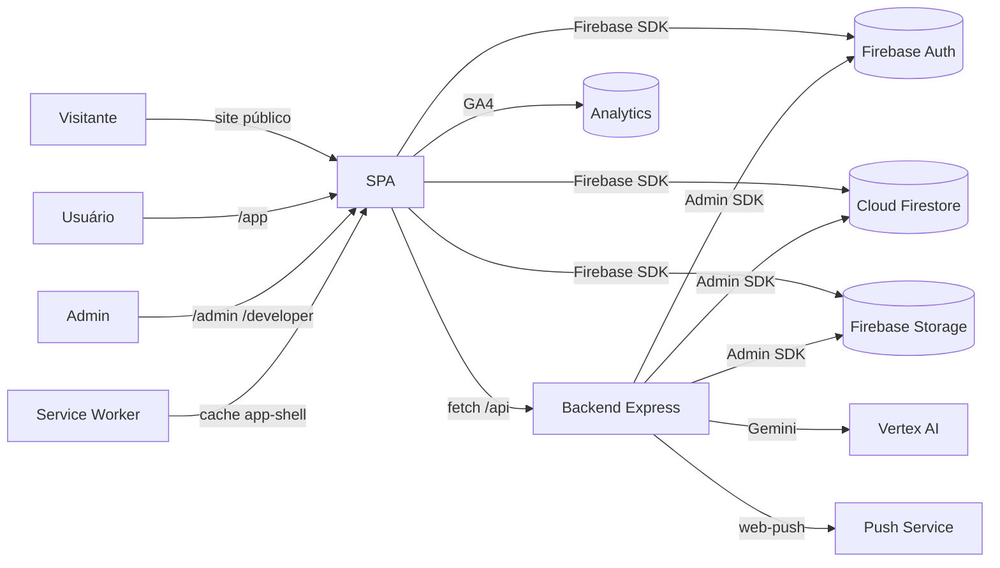

# 01 — SYSTEM OVERVIEW

> Status do documento: **vivo**. Reflete o código em `src/`, `backend/`, `public/`, `firestore.rules`.

---

## 1. Propósito

Visão de contexto da FLOW: quem são os atores, quais são os sistemas, como os dados circulam e onde cada parte do código vive.

## 2. Atores

| Ator | Acesso | Exemplos de uso |
|---|---|---|
| Visitante anônimo | Site público (`/`, `/produto`, `/sobre`, `/blog`, `/carreiras`, `/contato`, ...) | Landing, leitura de comunidades/criadores públicos, newsletter, contato |
| Usuário autenticado | `/app/*` (após login + consentimento LGPD) | Feed, perfil, mensagens, notificações, comunidades, eventos, stories, shorts, agenda, criador |
| Criador | `/app/criador*` | Central do criador (estatísticas reais de posts) |
| Moderador | `/admin/*` (subset de páginas) | Fila de moderação, conteúdo, comunidades, mensagens, memorial, suporte |
| Admin | `/admin/*` + `/developer/*` | Usuários, RH, configurações, logs, módulos, site, sistema, relatórios, developer |
| Bot backend / agendador | Via Admin SDK | Publicação agendada, persona Marina, notificações push |
| IA (Gemini Guardian) | Backend | Moderação automática de conteúdo (off por padrão) |

## 3. Visão de contexto



## 4. Componentes principais

| Componente | Local | Responsabilidade |
|---|---|---|
| Bootstrap | `src/main.tsx` | Monta React, registra SW, error boundary, offline notice, install prompt |
| Router | `src/App.tsx` | Roteador manual (history API), gate de módulos, consentimento, shell por área |
| AppContext | `src/contexts/AppContext.tsx` | Sessão Firebase, sessão admin, consentimento |
| PlayerContext | `src/contexts/PlayerContext.tsx` | Player de áudio flutuante |
| Serviços Firebase | `src/services/firebase/*` | Auth, social, comunidades, mensagens, notificações, memorial, etc. |
| Cliente API | `src/services/api/client.ts` | Única fronteira HTTP com o backend |
| Backend | `backend/src/*` | Express + Admin SDK + Guardian + push + scheduler |
| Shell canônico | `src/components/layout/AppShell` | Topbar/Sidebar/RightRail/BottomNav/FloatingPlayer |

## 5. Fluxos de dados de alto nível

### 5.1 Leitura de feed
```
SocialFeed → usePosts → listDocumentsPage(posts, cursor)
  → Firestore (rules: leitura autenticada)
  → enriquece autores (users/{authorId})
  → rankFeed (client-side) → UI
```

### 5.2 Criação de post
```
CreatePostModal → uploadPostMedia (Storage) → createPost (posts)
  → rules: authorId == uid && type in [text,image,video]
  → fan-out de notificação via POST /api/v1/notify (fallback Firestore)
```

### 5.3 Notificação push
```
Usuário ativa push → GET /api/v1/meta (VAPID)
  → pushManager.subscribe → POST /api/v1/push/subscribe
  → backend grava push_subscriptions e dispara via web-push
```

### 5.4 Moderação com IA (opt-in)
```
POST /api/v1/posts → ModerateContentUseCase
  → GuardianFeatureFlag (FLOW_GUARDIAN_ENABLED)
  → GeminiGuardianAdapter (Vertex AI)
  → FirestoreModerationRepository (guardian_moderations)
  → allow → publica | review → visibility=moderation | block → 422
```

## 6. Contrato de dependências entre camadas

```
Páginas (src/app, src/admin)
   └─ Components (src/components)
        └─ Hooks (src/hooks)
             └─ Contexts (src/contexts)
                  └─ Services (src/services) ← fronteira de integração
                       ├─ services/firebase → Firebase SDK
                       └─ services/api → fetch backend
```

Regras (validadas em `README.md`):
1. Componentes **não** chamam Firestore/API diretamente (exceção histórica: `ReportDialog`, `RightRail`, `SiteContato` — a consolidar).
2. Regras de negócio puras vivem em `src/app/commerce/*` (policies) e `src/core/*`.
3. Nenhum segredo administrativo existe no frontend.

## 7. Áreas de produto e suas rotas

Ver `37-SCREEN-CATALOG.md` para a matriz completa. Resumo:

| Área | Rotas |
|---|---|
| Site público | `/`, `/produto`, `/recursos`, `/sobre`, `/imprensa`, `/comunidades`, `/criadores`, `/baixar-app`, `/ajuda`, `/seguranca`, `/privacidade`, `/termos`, `/contato`, `/blog`, `/carreiras` |
| Auth | `/login`, `/cadastro`, `/recuperar-senha`, `/redefinir-senha`, `/verificar-email`, `/seguranca/2fa*`, `/conta/*`, `/central-contas` |
| Rede social | `/app`, `/app/feed`, `/app/explorar`, `/app/shorts`, `/app/stories`, `/app/pesquisa`, `/app/post/:id`, `/app/mensagens`, `/app/notificacoes`, `/app/comunidades`, `/app/eventos`, `/app/salvos`, `/app/configuracoes`, `/app/perfil`, `/app/criador`, `/app/agendamento`, `/app/criar` |
| Comércio (placeholder honesto) | `/app/shop`, `/app/loja`, `/app/pedidos`, `/app/rewards`, `/app/anunciar` |
| Segurança/denúncia | `/app/denunciar`, `/app/seguranca` |
| Memorial | `/memorial*`, `/configuracoes/memorial` |
| Admin | `/admin/*` |
| Developer | `/developer/*` |
| Consentimento | `/consentimento` |

## 8. Estados globais

- **Auth:** `AppContext` → `authenticated`, `user`, `loading`, `needsConsent`.
- **Admin:** `AdminAuthContext` → `adminUser`, `adminAuthenticated`, role.
- **Módulos:** `useModuleStates` → `platform_settings/modules`.
- **Player:** `PlayerContext`.

## 9. Restrições e dependências externas atuais

| Dependência | Uso | Nota |
|---|---|---|
| Firebase (Auth/Firestore/Storage/Analytics) | Infra central | Config via `VITE_FIREBASE_*`; sem env → modo local com aviso (`FirebaseRuntimeNotice`) |
| Backend Express | Notify/push/contato/reports/feed/guardian/scheduler | URL via `VITE_API_BASE_URL` (default `http://localhost:8080/api/v1`) |
| Vertex AI (Gemini) | Guardian | Off por padrão (`FLOW_GUARDIAN_ENABLED=false`) |
| VAPID (web-push) | Push | Chaves no backend |
| GA4 (gtag) | Analytics | `index.html` + `services/firebase/analytics` |
| Vercel | Deploy frontend | `vercel.json` SPA rewrite |

## 10. Resumo de maturidade

A FLOW está em estado de **"produto intermediário avançado"**: núcleo social completo e real (feed, posts, likes, comentários, follow, salvar, bloquear, comunidades, mensagens, notificações, eventos, stories, agendamento, memorial, admin real, RBAC real), com gaps honestamente marcados (marketplace/ads/rewards sem backend, push nativo parcial, ranking server-side, busca semântica, analytics histórico).

Consulte `44-GAP-ANALYSIS.md` para a comparação completa.