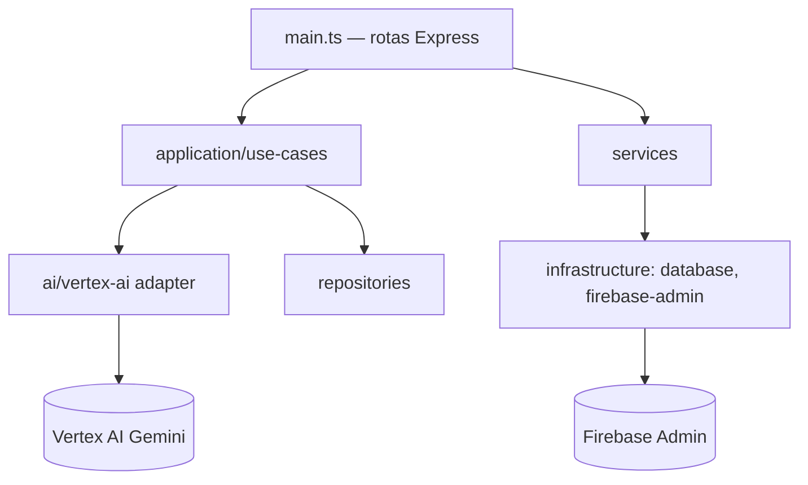

# 03 — BACKEND ARCHITECTURE

> Status do documento: **vivo**. Baseado em `backend/`.

---

## 1. Visão geral

O backend da FLOW é um **servidor Express (Node.js, ESM)** que complementa o Firebase. Ele não substitui o client-side Firebase: autenticação canônica é feita pelo Firebase no cliente; o backend usa **Firebase Admin SDK** para operações privilegiadas (notificações, push, moderação, agendamento, relatórios).

```
backend/
├── package.json
├── tsconfig.json
├── .env.example
├── src/
│   ├── main.ts                       # entrypoint HTTP + rotas
│   ├── config/env.ts                 # schema Zod do ambiente
│   ├── middleware/
│   │   ├── request-logger.ts         # log JSON estruturado (x-request-id)
│   │   └── require-auth.ts           # requireAuth + requireAdmin
│   ├── application/
│   │   └── guardian/                 # caso de uso de moderação
│   │       ├── feature-flag.service.ts
│   │       └── moderate-content.use-case.ts
│   ├── domain/guardian/moderation-result.ts
│   ├── infrastructure/
│   │   ├── database.ts               # conectividade Admin
│   │   ├── firebase/firebase-admin.ts
│   │   ├── ai/vertex-ai/gemini-guardian.adapter.ts
│   │   └── guardian/firestore-moderation.repository.ts
│   └── services/
│       ├── auth.service.ts
│       ├── cache.service.ts
│       ├── contact.service.ts
│       ├── content.service.ts
│       ├── metrics.service.ts
│       ├── notify.service.ts
│       ├── persona.service.ts
│       ├── report.service.ts
│       ├── scheduler.service.ts
│       └── storage-audit.service.ts
└── tests/domain.test.ts
```

## 2. Stack e dependências

| Pacote | Finalidade |
|---|---|
| express | HTTP |
| firebase-admin | Auth/Firestore/Storage privilegiados |
| @google/genai | Gemini Guardian (Vertex AI) |
| web-push | Notificações push (VAPID) |
| argon2 | Hash (reservado) |
| jsonwebtoken | Tokens (reservado) |
| zod | Validação de env e inputs |
| helmet, cors, express-rate-limit | Segurança |
| dotenv | Config |

## 3. Ambiente (`backend/src/config/env.ts`)

Campos principais (`backend/.env.example`, marcado "FASE 2"):
- `PORT=8080`, `NODE_ENV`
- `FIREBASE_PROJECT_ID`, `FIREBASE_CLIENT_EMAIL`, `FIREBASE_PRIVATE_KEY`, `FIREBASE_STORAGE_BUCKET`
- `GOOGLE_APPLICATION_CREDENTIALS`, `GOOGLE_CLOUD_PROJECT`, `GOOGLE_CLOUD_LOCATION=global`
- `FLOW_GUARDIAN_ENABLED=false`, `FLOW_GUARDIAN_MODEL=gemini-2.5-flash`, `FLOW_GUARDIAN_TIMEOUT_MS=8000`
- `CORS_ORIGIN` (default `https://flow-web-mu.vercel.app,http://localhost:3000`)
- `VAPID_PUBLIC`, `VAPID_PRIVATE`, `VAPID_SUBJECT`

> **Observação técnica:** `firebase-admin.ts` carrega credenciais via `GOOGLE_APPLICATION_CREDENTIALS` (JSON), `backend/secrets/*.json` ou ADC — os campos `FIREBASE_CLIENT_EMAIL`/`FIREBASE_PRIVATE_KEY` do `.env.example` **não são lidos** pelo loader atual.

## 4. Rotas (endpoints)

| Método | Rota | Auth | Serviço | Comportamento |
|---|---|---|---|---|
| GET | `/health` | — | — | JSON de saúde + flag guardian |
| GET | `/api/v1/meta` | — | cache | metadados, versão, rotas, VAPID, cache stats (60s) |
| GET | `/api/v1/metrics` | sim | metrics | métricas em memória |
| POST | `/api/v1/auth/register` | — | auth | cria usuário via Admin SDK + doc `users` (role `USER`, status `ACTIVE`) |
| POST | `/api/v1/auth/login` | — | auth | **sempre 401** — login é client-side (`USE_FIREBASE_CLIENT_AUTH`) |
| GET | `/api/v1/feed` | — | content | feed cronológico (15s cache) |
| POST | `/api/v1/posts` | — | content | criar post com Guardian (block→422, timeout→503) |
| POST | `/api/v1/posts/:id/like` | — | content | like (transação) |
| POST | `/api/v1/reports` | — | report | denúncia |
| POST | `/api/v1/contact` | — | contact | formulário de contato → `contact_messages` |
| POST | `/api/v1/notify` | sim | notify | notificação in-app + Web Push |
| POST | `/api/v1/push/subscribe` | sim | notify | salva inscrição push |
| DELETE | `/api/v1/push/subscribe` | sim | notify | remove inscrição push |
| GET | `/api/v1/admin/storage-audit` | admin | storage-audit | varre órfãos no Storage |

Rate limit: writes → 30/min por IP.

## 5. Arquitetura em camadas

O backend segue separação **Presentation / Application / Domain / Infrastructure**:



- `domain/guardian/moderation-result.ts` — tipos puros (action/category/confidence).
- `application/guardian/moderate-content.use-case.ts` — orquestra flag→IA→repo.
- `infrastructure/*` — portas e adapters (Gemini, Firestore moderation repo).
- `services/*` — lógica de serviço (não são "controllers gigantes").

## 6. Cache (`services/cache.service.ts`)

- Cache **em memória** com TTL (`cacheGet`, `cacheSet`, `cacheInvalidate`, `cacheStats`).
- Usado em: `/api/v1/meta` (60s), `/api/v1/feed` (15s).
- `[PLANEJADO]` substituir por Redis em escala (ver `20-CACHE-ARCHITECTURE.md`).

## 7. Métricas (`services/metrics.service.ts`)

- `recordRequest(route, status, ms)` → uptime, contagem, erros, por-rota (count/avgMs/maxMs).
- Exposto em `GET /api/v1/metrics` (autenticado).
- `[PLANEJADO]` prometheus/OTel (ver `18-OBSERVABILITY.md`).

## 8. Moderação com IA — Guardian

- Flag: `FLOW_GUARDIAN_ENABLED` (default `false`).
- `GeminiGuardianAdapter` — modelo `gemini-2.5-flash`, resposta JSON com schema (action/category/confidence/reason), timeout configurável, erro → `GUARDIAN_TIMEOUT`.
- `FirestoreModerationRepository` — grava em `guardian_moderations`.
- Ações: `allow` → publica; `review` → `visibility:'moderation'`; `block` → HTTP 422 `CONTENT_BLOCKED_BY_GUARDIAN`.
- Aplicado em: `POST /api/v1/posts`, scheduler de publicações.

## 9. Scheduler (`services/scheduler.service.ts`)

- `startPublicationScheduler(60_000)` iniciado no boot.
- Worker 1 — `posts` com `status=='SCHEDULED'` e `scheduledAt<=now` (limite 20): reivindica via transação `SCHEDULED→PROCESSING`, roda Guardian, publica (`PUBLISHED`) ou falha (`FAILED`) + audit de persona. Pula `schedulerManaged===true`.
- Worker 2 — `scheduled_posts` com `SCHEDULED→PUBLISHING`, publica o post vinculado.

## 10. Notificações e push (`services/notify.service.ts`)

- `notifyUser(actorUid, input)` — valida, grava `users/{target}/notifications` (`read:false`), dispara Web Push (best-effort), remove endpoints mortos (410/404).
- Rejeita `NOTIFY_SELF` (auto-notificação).
- Inscrições em `push_subscriptions/{uid}/targets` (id = sha256 do endpoint).

## 11. Persona (IA) — `services/persona.service.ts`

- Persona "Marina Silva": posta 2×/dia, 7×/semana, horários 8/12/18, `discloseAi:true`, `origin:'PERSONA_SEED'`.
- Upload de imagens de `public/maria-silva-imagens` para Storage com URLs assinadas de longa duração.
- Seeds: `backend/src/seed-marina.ts`; bootstrap admin: `backend/src/seed-admin.ts`.

## 12. Segurança do backend

- Helmet, CORS restrito, rate limit.
- `requireAuth`: verifica Bearer ID token do Firebase → `req.uid`.
- `requireAdmin`: consulta `users/{uid}.role == 'admin'` → senão 403.
- Log estruturado com `x-request-id` em `request-logger`.
- **Nunca** confiar no frontend: regras do Firestore + `requireAdmin` são a autorização real.

## 13. Testes

- `backend/tests/domain.test.ts` — testes de domínio leves (sem Firebase/externo): categorias proibidas de marketplace + janela de proteção de 7 dias.
- `npm test` → `tsx tests/domain.test.ts`.

## 14. Limitações e dívida

| Item | Status |
|---|---|
| `POST /api/v1/auth/login` sempre 401 (login client-side é canônico) | `[PARCIAL]` — por design |
| Cache em memória (perde em restart/multi-instância) | `[PARCIAL]` |
| Métricas em memória | `[PARCIAL]` |
| Nenhum fila/job broker (RabbitMQ/Cloud Tasks) | `[NÃO IMPLEMENTADO]` |
| Nenhum OpenTelemetry/tracing distribuído | `[NÃO IMPLEMENTADO]` |
| Backend não implantado em produção (Vercel só frontend) | `[NÃO IMPLEMENTADO]` |
| Carga de credenciais via JSON file (não via env `FIREBASE_CLIENT_EMAIL/PRIVATE_KEY`) | `[PARCIAL]` |

## 15. Roadmap do backend

1. **FASE atual → Growth:** Redis (cache), Postgres/SQL ou continua Firestore com melhor indexação, fila de jobs (Cloud Tasks/Firestore queue), OTel.
2. **Scale:** separar serviços (feed/notify/guardian), workers dedicados, autoscaling.
3. Ver `26-SCALABILITY-ARCHITECTURE.md` e `45-ROADMAP.md`.