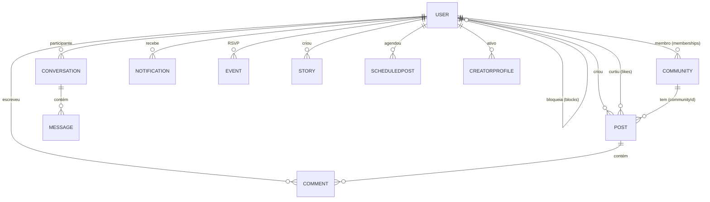

# 04 — DOMAIN ARCHITECTURE

> Status do documento: **vivo**. Descreve o domínio da FLOW como está hoje e a direção evolutiva.

---

## 1. Entidades de domínio atuais

> Modelo de dados real → `05-DATABASE-ARCHITECTURE.md` e `39-DATABASE-CATALOG.md`.

| Entidade | Fontes de verdade (Firestore) | Tipo |
|---|---|---|
| User / Profile | `users/{uid}` | Agregado |
| Post | `posts/{id}` | Agregado |
| Comment | `posts/{id}/comments/{cid}` | Agregado filho |
| Like | `posts/{id}/likes/{uid}` | Associação |
| Follow | `users/{uid}/following/{tid}` + `users/{tid}/followers/{uid}` | Associação bidirecional |
| Save | `users/{uid}/saved/{postId}` | Associação |
| Block | `users/{uid}/blocks/{tid}` | Associação |
| Community | `communities/{id}` | Agregado |
| CommunityMembership | `communities/{id}/members/{uid}` + `users/{uid}/memberships/{cid}` | Associação |
| Story | `stories/{id}` | Agregado (TTL 24h) |
| Conversation | `conversations/{id}` | Agregado |
| Message | `conversations/{id}/messages/{mid}` | Agregado filho |
| Notification | `users/{uid}/notifications/{nid}` | Agregado filho |
| Event | `events/{id}` | Agregado |
| Rsvp | `events/{id}/rsvps/{uid}` | Associação |
| Report | `reports/{id}` | Agregado |
| Appeal | `appeals/{id}` | Agregado |
| Consent | `consents/{uid}` | Agregado |
| CreatorProfile | `creator_profiles/{uid}` | Agregado |
| ScheduledPost | `scheduled_posts/{id}` | Agregado |
| JobPost / JobApplication | `job_posts`, `job_applications` | Agregado |
| ContactMessage | `contact_messages` | Agregado |
| NewsletterSubscription | `newsletter` | Agregado |
| SitePage | `site_pages` | Agregado |
| PlatformSettings / Modules | `platform_settings/{global,modules}` | Config |
| MemorialRequest / Tribute | `memorial_requests`, `tributes` | Agregado |
| AdminAuditEntry | `admin_audit/{id}` | Evento/log |
| GuardianModeration | `guardian_moderations` (backend) | Evento/log |
| PushSubscription | `push_subscriptions/{uid}/targets` (backend) | Config |
| Persona | `personas`, `audit_logs` (backend) | Agregado IA |

## 2. Entidades de domínio puras (contratos, sem persistência)

Localizadas em `src/app/commerce/`, `src/app/rewards/`, `src/services/*`:

| Arquivo | Conteúdo |
|---|---|
| `CommerceFoundation.ts` | `AdProvider`, `ReportPriority`, `ReportCategory`, `NativeAdPost`, `ReportCase`, `Store`, `Product`, `REPORT_CATEGORIES` |
| `CommerceOperations.ts` | `createProtectedOrder`, `markDelivered`, `confirmReceipt`, `requestReturn`, `requestDispute`, `taskReward` |
| `FlowShopPolicy.ts` | `FLOW_SHOP_POLICY`, `BUYER_CONFIRMATION_WINDOW_DAYS=7`, `FUNDS_RELEASE_AFTER_CONFIRMATION_DAYS=7`, `calculateReleaseDate`, `calculateCaseDeadline` |
| `MarketplaceRules.ts` | `PROHIBITED_PRODUCT_RULES`, `calculateProtectedOrder`, `getPayoutEligibility`, `isRewardEligible`, tipos de produto/proteção/afiliado |
| `ProductPolicy.ts` | `evaluateProductCompliance`, `canPublishProduct` |
| `RewardFoundation.ts` | `DEFAULT_REWARD_POLICY` (dailyLimit 1, minWatchSeconds 10, reward 0.01, fraud 70) |
| `src/core/modules/ModuleRegistry.ts` | `FLOW_MODULES` (21 módulos), estados, rotas |
| `src/services/feed/ranking.ts` | `scorePost`, `rankFeed` |
| `src/services/identity/index.ts` | `verifyIdentity` **[MOCK]** |
| `src/services/moderation/index.ts` | `submitReport` **[MOCK]** |
| `src/services/ads/index.ts` | tipos de ads somente |

> **Regra de ouro:** regras de negócio complexas (políticas) são **funções puras testadas**; nunca estão em JSX nem em queries espalhadas.

## 3. Relações de domínio

## 4. Value Objects

- `upload` de mídia → `UploadResult { url, path }`.
- Hashtags → `extractHashtags(text)` (lista única).
- Timestamps → `serverTimestamp()`; datas pt-BR via helpers de schedule/profile.
- Status de conta → `'active' | 'blocked' | 'deactivated' | 'suspended'`.
- Status de post → `'text' | 'image' | 'video'` + `visibility` (`public`/`private`/`moderation`).

## 5. Invariantes importantes

| Invariante | Onde se aplica |
|---|---|
| `users/{uid}.role` só muda por admin (rules: admin update em `role`) | `firestore.rules` |
| `posts.authorId == auth.uid` na criação | `firestore.rules` |
| Like não-duplicado via transação + doc único `posts/{id}/likes/{uid}` | `social.ts` |
| Follow bidirecional consistente (`following` + `followers`) | `social.ts` |
| Comentário ≤ 500 chars; post ≤ 2000 chars | `social.ts` |
| Story expira em 24h (`STORY_TTL_MS`) | `stories.ts` |
| Denúncia sempre tem `reporterId == auth.uid` | `firestore.rules` |
| Notificação self é rejeitada (`NOTIFY_SELF`) | `notify.service.ts` |
| Comunidade: dono não pode mudar `ownerId` | `firestore.rules` |

## 6. Regras de evolução do domínio

1. **Adicionar entidades via funções puras + testes** antes de conectar UI (padrão usado no commerce).
2. **Nunca acoplar domínio ao Firebase** — manter contratos TS puros.
3. **Documentar invariantes** em ADR quando mudar (ver `adr/`).
4. Quando o grafo crescer, considerar **lista de arestas explícita** (padrão TAO) em vez de subcoleções embutidas (ver `08-SOCIAL-GRAPH.md` §10).