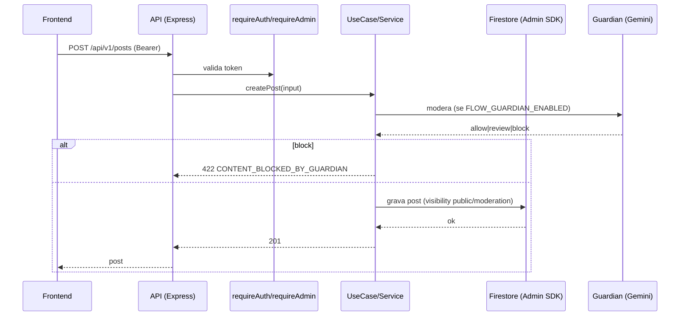

# 07 — API ARCHITECTURE

> Status do documento: **vivo**. Baseado em `backend/src/main.ts` e `src/services/api/client.ts`.

---

## 1. Princípios

- **API-First**: o frontend só se comunica com o backend via `src/services/api/client.ts` (fronteira única).
- **Bearer token do Firebase**: client envia `Authorization: Bearer <ID token>` quando autenticado.
- **Nunca confiar no frontend**: o backend valida/auth em `requireAuth`/`requireAdmin` e Firestore Rules.
- **Base URL**: `VITE_API_BASE_URL` (default `http://localhost:8080/api/v1`); `VITE_API_URL` deprecated.
- **Proxy dev**: `vite.config.ts` proxya `/api` para o backend local (FASE 2).
- **Proteção**: `client.ts` lança se base URL ausente ou resposta não-JSON (evita HTML fallback do Vercel).

## 2. Cliente HTTP (`src/services/api/client.ts`)

```ts
type ApiRequest = { path: string; method?: string; body?: unknown; signal?: AbortSignal };
apiRequest<T>({ path, method, body, signal }): Promise<T>
```

- `credentials: 'include'`, `Content-Type: application/json`.
- Inclui `Authorization: Bearer <firebaseAuth.currentUser token>` quando disponível.
- Erros extraídos do body da resposta.

## 3. Contrato de rotas implementadas

| Método | Rota | Auth | Corpo/Query | Resposta | Erros |
|---|---|---|---|---|---|
| GET | `/health` | — | — | `{status, uptime, guardian}` | 500 |
| GET | `/api/v1/meta` | — | — | `{service, version, routes, vapidPublic, cache}` | — |
| GET | `/api/v1/metrics` | sim | — | métricas em memória | 401 |
| POST | `/api/v1/auth/register` | — | `{email,password,name,...}` | usuário criado | 400/409 |
| POST | `/api/v1/auth/login` | — | `{email,password}` | **sempre 401** (`USE_FIREBASE_CLIENT_AUTH`) | 401 |
| GET | `/api/v1/feed` | — | `limit, before, mode=for-you\|following` | posts + cursor | 400 |
| POST | `/api/v1/posts` | — | `{text,type,mediaUrl,...}` | post | 422 Guardian block / 503 timeout / 400 |
| POST | `/api/v1/posts/:id/like` | — | — | ok | 404/401 |
| POST | `/api/v1/reports` | — | `{reporterId,targetType,targetId,category}` | ok | 400 |
| POST | `/api/v1/contact` | — | `{name,email,subject,category,message}` | `{protocolId}` | 400 |
| POST | `/api/v1/notify` | sim | `{targetUid,type,actorName,actorAvatar,text}` | ok | 401/400/NOTIFY_SELF |
| POST | `/api/v1/push/subscribe` | sim | `{endpoint,keys}` | ok | 400 |
| DELETE | `/api/v1/push/subscribe` | sim | `{endpoint}` | ok | 400 |
| GET | `/api/v1/admin/storage-audit` | admin | — | `{scanned,referenced,orphans,truncated}` | 403 |

Rate limit: writes → 30/min por IP (`express-rate-limit`).

## 4. Fluxo de uma operação típica (POST /api/v1/posts)



## 5. Fluxo de fan-out de notificação

```
Frontend createPost/toggleLike/addComment/toggleFollow
  → POST /api/v1/notify (best-effort)
  → backend: valida, grava users/{target}/notifications, dispara Web Push
  → falha? → fallback: pushNotification direto no Firestore (cliente)
```

## 6. Validação e erros

- `zod` no `env.ts` e inputs de serviço (notify/contact/report).
- Erros com códigos estáveis: `CONTENT_BLOCKED_BY_GUARDIAN`, `GUARDIAN_TIMEOUT`, `NOTIFY_SELF`, `USE_FIREBASE_CLIENT_AUTH`.
- `request-logger` registra `x-request-id` em todo request.

## 7. Observabilidade de API

- `GET /api/v1/metrics` — real em memória.
- `GET /api/v1/meta` — cache stats.
- `[PLANEJADO]` OpenTelemetry + tracing (ver `18-OBSERVABILITY.md`).

## 8. Roadmap de API

1. **Adicionar** endpoints de feed/ranking server-side real, paginação de comentários, busca.
2. **Padronizar** envelope de resposta (`{data, meta}`) para contratos futuros.
3. **Versionamento**: já em `/api/v1`.
4. **Rate limiting** por usuário (não só IP).
5. **Idempotência** em writes (client-generated ids ou `Idempotency-Key`).
6. Ver `38-API-CATALOG.md` e `45-ROADMAP.md`.