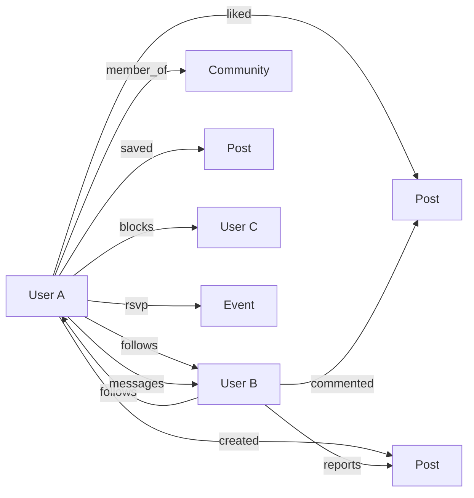

# 08 — SOCIAL GRAPH

> Status do documento: **vivo**. Especificação do grafo social da FLOW e sua evolução.
> Referência de maturidade: TAO (entidades + associações) — [engineering.fb.com/2013/06/25/core-infra/tao-the-power-of-the-graph](https://engineering.fb.com/2013/06/25/core-infra/tao-the-power-of-the-graph/).

---

## 1. Modelo conceitual

A FLOW modela o grafo como **entidades** e **associações** (arestas), persistidas no Firestore:

| Entidade | Representação Firestore |
|---|---|
| User | `users/{uid}` |
| Post | `posts/{id}` |
| Comment | `posts/{id}/comments/{cid}` |
| Community | `communities/{id}` |
| Conversation | `conversations/{id}` |
| Story | `stories/{id}` |
| Event | `events/{id}` |
| Notification | `users/{uid}/notifications/{nid}` |
| Media | Storage `users/{uid}/...` |

| Associação (aresta) | Origem → Destino | Cardinalidade | Persistência |
|---|---|---|---|
| FOLLOW | User → User | N:N | `users/{uid}/following/{tid}` + `users/{tid}/followers/{uid}` |
| CREATED | User → Post | 1:N | `posts.authorId` |
| LIKED | User → Post | N:N (1 like/user) | `posts/{id}/likes/{uid}` |
| COMMENTED | User → Post | N:N | `posts/{id}/comments` |
| MEMBER_OF | User → Community | N:N | `communities/{id}/members/{uid}` + `users/{uid}/memberships/{cid}` |
| SAVED | User → Post | N:N | `users/{uid}/saved/{postId}` |
| BLOCKS | User → User | N:N | `users/{uid}/blocks/{tid}` |
| RSVP | User → Event | N:N | `events/{id}/rsvps/{uid}` |
| MESSAGE | User ⇄ User | N:N (via conv) | `conversations` + `messages` |
| REPORTS | User → {Post,User,Community,...} | N:N | `reports` |
| TRIBUTE | User → Memorial | N:N | `tributes` |

## 2. Diagrama do grafo

## 3. Especificação por relação

### FOLLOW (implementado)
- Origem: `users/{uid}/following/{targetId}`; Destino: `users/{targetId}/followers/{uid}`.
- Escrita em `Promise.all` (bidirecional), evita self-follow (`throw`).
- Permissão: só o próprio uid (rules).
- Efeito no feed: filtro "Seguindo" + sinal de afinidade no ranking client-side.
- Efeito em notificações: fan-out `follow` via `POST /api/v1/notify` (fallback Firestore).
- Índices: nenhum específico (leitura por path).

### CREATED / LIKED / COMMENTED (implementados)
- `posts` com `authorId`; likes em subcoleção transacional; comentários com `parentId` (threading).
- Notificações fan-out para o autor do post.
- Contadores `likesCount/commentsCount/sharesCount` incrementais.

### MEMBER_OF (implementado)
- Espelho duplo: `communities/{id}/members` (autoritativo) + `users/{uid}/memberships`.
- `memberCount` derivado (risco de drift).

### BLOCKS (implementado)
- Grafo privado do usuário; bloqueados removidos do feed/explore (`SocialFeed`, `ExploreModule`).

### MESSAGE (implementado)
- Participantes lêem/escrevem; admin audita (list/read); sem update/delete.
- Realtime via `onSnapshot`.

### REPOST/SHARE (parcial)
- Compartilhamento via **copy-link** (clipboard) apenas. Não há aresta persistida de repost.
- `sharesCount` existe no post, mas não há fluxo de incremento real. `[PARCIAL]`

### MENTION (não implementado)
- `extractHashtags` existe; menções `@user` **não** são parseadas/notificadas. `[NÃO IMPLEMENTADO]`

### FRIENDSHIP (ausente por decisão)
- Modelo follow-only (decisão de produto documentada). `[NÃO IMPLEMENTADO]`

### PAGE (parcial)
- Comunidades aproximam o papel de "páginas"; não há entidade `Page` distinta. `[PARCIAL]`

### MarketplaceListing (não implementado)
- Tipos `Store`/`Product` existem como contratos puros; sem persistência/UI. `[NÃO IMPLEMENTADO]`

## 4. Impacto no Feed por relação

| Relação | Efeito no feed atual |
|---|---|
| FOLLOW | Filtro "Seguindo"; afinidade +3 no ranking |
| CREATED | Fonte principal do feed (`posts`) |
| LIKED | Sinal de engajamento no ranking (`log1p`) |
| COMMENTED | Idem |
| BLOCKS | Remove autor |
| SAVED | Não afeta feed (módulo Salvos) |

## 5. Impacto em notificações por relação

| Relação | Notificação |
|---|---|
| LIKED | like (se autor ≠ ator) |
| COMMENTED | comment / reply |
| FOLLOW | follow |
| MESSAGE | (in-app via mensagens; push quando backend ativo) |
| TRIBUTE | (no fluxo atual: silencioso) |
| MEMBER_OF | (sem notificação atualmente) |

## 6. Permissões por relação (Firestore Rules)

- Leitura do grafo de `following/followers` **restrita ao próprio uid** (privacidade por design).
- Membros de comunidades: leitura pública.
- Likes/comments: leitura autenticada.
- Bloqueios: só o dono.
- Notificações: dono + admin.

## 7. Avaliação de crescimento

**Problemas atuais (Firestore):**
1. Fan-out de notificações **síncrono/best-effort** — falha silenciosa em escala.
2. Leitura de grafo de following exige N+1 (`listDocuments('users/{uid}/following')` → carregar posts de cada).
3. Contadores derivados podem driftar.
4. Sem arestas para menções, reposts, amizades, lista de leitura.
5. Feed "Seguindo" não tem índice dedicado de fan-out (posts são consultados globalmente e filtrados no cliente).

**Resposta evolutiva (padrão TAO-like):**
- Manter associações em **coleções de aresta nomeadas** (como hoje) e evoluir para:
  - **Fan-out em fila** (assíncrono) para notificações/feed (ver `19-EVENT-DRIVEN-ARCHITECTURE.md`).
  - **Índices compostos** para queries de grafo comuns.
  - **Cache de grafo** (Redis) para hot paths (following lists).
  - **Contadores consistentes** via recomputação/agregação.

## 8. Entidades novas planejadas (ver `45-ROADMAP.md`)

| Entidade/Relação | Prioridade | Motivo |
|---|---|---|
| Mention (`@user`) | P1 | descoberta + notificação |
| Repost (aresta persistida) | P1 | engajamento |
| Friendship (solicitação/aceite) | P2 | modelo alternativo |
| Page | P2 | marca/institucional |
| MarketplaceListing | P3 | commerce |
| Reaction diversificada | P3 | engajamento |

## 9. Matriz de maturidade do grafo

| Relação | Estado | Persistência | Notificação | Feed | Teste |
|---|---|---|---|---|---|
| FOLLOW | [IMPLEMENTADO] | sim | sim | sim | — |
| CREATED | [IMPLEMENTADO] | sim | — | sim | sim (commerce) |
| LIKED | [IMPLEMENTADO] | sim (transação) | sim | sinal | sim |
| COMMENTED | [IMPLEMENTADO] | sim | sim | sinal | — |
| SAVED | [IMPLEMENTADO] | sim | — | — | — |
| BLOCKS | [IMPLEMENTADO] | sim | — | sim | — |
| MEMBER_OF | [IMPLEMENTADO] | sim (espelho) | — | — | sim |
| MESSAGE | [IMPLEMENTADO] | sim | sim (push) | — | — |
| RSVP | [IMPLEMENTADO] | sim | — | — | sim |
| REPORTS | [IMPLEMENTADO] | sim | admin | — | — |
| TRIBUTE | [IMPLEMENTADO] | sim | — | — | — |
| REPOST | [PARCIAL] | não | — | — | — |
| MENTION | [NÃO IMPLEMENTADO] | não | não | — | — |
| FRIENDSHIP | [NÃO IMPLEMENTADO] (decisão) | não | não | — | — |
| PAGE | [PARCIAL] | não | — | — | — |

## 10. Conclusão

O grafo social da FLOW está **implementado e real** para o núcleo social. A arquitetura de associações como subcoleções nomeadas é **compatível** com evolução para arestas em escala (TAO-like), desde que fan-out, índices, cache e contadores sejam endereçados antes do crescimento significativo.