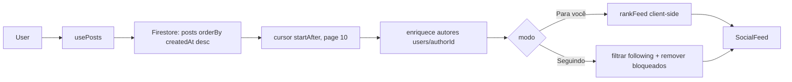

# 09 — FEED ARCHITECTURE

> Status do documento: **vivo**. Referência de maturidade: [News Feed Ranking (Meta)](https://engineering.fb.com/2021/01/26/core-infra/news-feed-ranking/).

---

## 1. Estado atual

### 1.1 Pipeline atual (client-first)



### 1.2 Componentes

| Camada | Local | Função |
|---|---|---|
| Página | `src/app/SocialFeed.tsx` | orquestra feed, abas, stories, modal de criação |
| Hook | `src/hooks/usePosts.ts` | paginação por cursor, enriquecimento de autores |
| Ranking | `src/services/feed/ranking.ts` | `scorePost`/`rankFeed` (client-side) |
| Tabs | `src/components/social/FeedTabs` | Para você / Seguindo / Comunidades |
| Card | `src/components/social/PostCard` | renderização + ações |
| Backend | `GET /api/v1/feed` | feed cronológico com cache 15s |

### 1.3 Modos
- **Para você (default):** todos os posts → `rankFeed`.
- **Seguindo:** posts de quem o usuário segue (filtro client-side) + bloqueados removidos.
- **Comunidades:** aba presente na UI (FeedTabs) — sem dados próprios ainda `[PARCIAL]`.

## 2. Sinais do ranking atual (client-side)

`src/services/feed/ranking.ts`:

| Sinal | Peso | Descrição |
|---|---|---|
| Recência | half-life 48h | posts mais novos pontuam mais |
| Afinidade | +3 | se o autor é seguido |
| Engajamento | `log1p(likes + 2*comments)` | interações importam mais que likes |
| Diversidade | −1.5 por autor repetido | evita dominância |
| Bloqueados | excluído | `blockedIds` removidos |

> `RankContext` (idade, following, blocked) é extensível para ranking server-side (FASE 9).

## 3. Arquitetura evolutiva

### 3.1 Nível 1 — Chronological Feed (atual, no Firestore)
- Query `posts` por `createdAt desc`, cursor.
- Válido até centenas de milhares de posts; custo de leitura cresce.

### 3.2 Nível 2 — Ranked Feed server-side
```mermaid
flowchart LR
  User --> Candidate[Feed Candidate Generation]
  Candidate --> Agg[Feed Aggregator]
  Agg --> Filtro[Filtering: visibilidade, bloqueio, moderação]
  Filtro --> Rank[Ranking engine]
  Rank --> Pag[Pagination cursor]
  Pag --> Cache[Cache (Redis/TTL)]
  Cache --> API[/api/v1/feed/me/]
  API --> Client[Client]
```

- **Candidate Sources:** posts de seguidos, comunidades, criadores em destaque, trending hashtags.
- **Ranking:** sinais ampliados (recência, afinidade, interação, qualidade de conteúdo, interesse, feedback implícito, contexto).
- **Cache:** TTL curto com invalidação por evento (post novo, follow novo, block).
- **Fallback:** cache vazio → cronológico.

### 3.3 Nível 3 — Personalized Recommendation Feed
- Embeddings de interesse, modelos de recomendação (offline batch + online score).
- Objetivos: relevância, diversidade, novidade, segurança.
- Feedback loops (ocultar, denunciar, deixar de seguir).

## 4. Requisitos funcionais do feed (todos os níveis)

| Requisito | Estado atual | Nível-alvo |
|---|---|---|
| Paginação por cursor | [IMPLEMENTADO] | manter |
| Freshness | carregamento manual / reload | push/realtime |
| Deduplicação | natural (docs únicos) | idempotência de eventos |
| Privacidade/visibilidade | filtro de bloqueados | rules + server |
| Fallback | vazio honesto | cache degradado |
| Failure handling | error state | retry/backoff |
| Recomendação | — | Nível 3 |

## 5. Feed do backend (já existente)

`GET /api/v1/feed?limit&before&mode=for-you|following`:
- `content.service.ts listFeed` — `visibility=='public'`, `createdAt desc`, cursor `before`, cache 15s.
- Não aplica ranking ainda; é o embrião do feed server-side.

## 6. Métricas do feed

- Latência de leitura (alvo p95 < 300ms no servidor).
- Frequência de reload/scroll infinito.
- Taxa de engajamento por posição.
- Taxa de "ocultar/denunciar".

## 7. Roadmap

1. **P0:** manter feed cronológico + ranking client-side (estado atual).
2. **P1:** fan-out de posts para feed "Seguindo" via fila + índice; paginação de comentários.
3. **P2:** ranking server-side com sinais e cache com invalidação por evento.
4. **P3:** recomendação personalizada (embeddings/ML).
Ver `45-ROADMAP.md`.