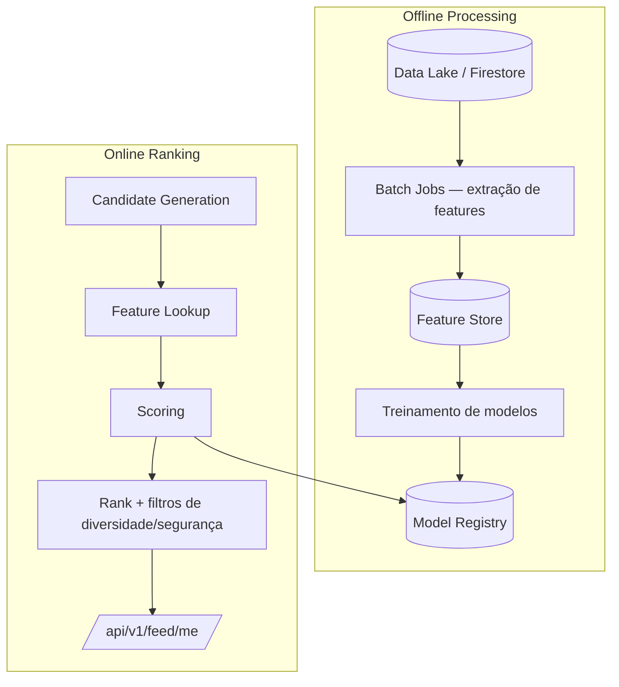

# 10 — RANKING ARCHITECTURE

> Status do documento: **vivo**. Referência de maturidade: [News Feed Ranking (Meta)](https://engineering.fb.com/2021/01/26/core-infra/news-feed-ranking/).
> **Regra:** não criar ML fake. Ranking inteligente só quando houver dados e backend reais.

---

## 1. Estado atual

- **Ranking client-side** em `src/services/feed/ranking.ts` (ver `09-FEED-ARCHITECTURE.md` §2).
- Não há ranking server-side implementado. `[PARCIAL]`

## 2. Sinais (feature set)

| Grupo | Sinal | Disponível hoje? |
|---|---|---|
| Recência | `createdAt` | sim |
| Relacionamento | `following`, `member_of`, `blocked` | sim (following/bloqueados) |
| Interação | likes, comments, shares counts | sim (posts) |
| Qualidade | comprimento do texto, mídia, verificação | parcial (fields existem) |
| Interesse | histórico de interação por usuário | **não** |
| Feedback | ocultar, denunciar, deixar de seguir | **não** (denúncia sim, ocultar não) |
| Frequência | frequência de uso do usuário | **não** |
| Contexto | dispositivo, horário, local | **não** |

## 3. Arquitetura alvo — offline + online



### 3.1 Offline
- Jobs periódicos (Cloud Tasks/Firestore queue) agregam features por usuário/item.
- Feature store: cache de preferências, co-ocorrência, CTR histórica.
- Modelo inicial simples: **logistic regression / GBM** sobre as features acima (nada de "IA fake").

### 3.2 Online
- `score = f(features)` com pesos aprendidos ou configuráveis.
- Filtros pós-ranking: diversidade (penalidade por autor repetido — já existe client-side), novidade, segurança (bloqueados, conteúdo moderado).
- Cache do ranking por usuário com invalidação por evento.

## 4. Score proposto (evolução do atual)

```
score(post) =
  w_recencia * recency(post.createdAt, halfLife)
+ w_afinidade * affinity(user, author)      // following, member, frequency
+ w_engajamento * log1p(likes + 2*comments + 3*shares)
+ w_qualidade  * quality(post)               // mídia, tamanho, verificado
+ w_interesse  * predictedInterest(user, topic)
+ w_contexto   * contextFit(user, time, device)
- w_diversidade * repeatedAuthorPenalty
```

Pesos iniciais: replicar o comportamento atual (`w_afinidade=3`, diversidade `−1.5`), com pesos reais a aprender depois.

## 5. Feature engineering recomendada

| Feature | Fonte |
|---|---|
| following author | `users/{uid}/following` |
| member of community | `users/{uid}/memberships` |
| likes/comments/shares do autor (histórico) | `posts` (agregação) |
| engagement do post | `posts.likesCount/commentsCount/sharesCount` |
| recência | `posts.createdAt` |
| hashtags | `extractHashtags` |
| feedback negativo | `reports`, `blocks` (sem expor a quem) |
| CTR do usuário por categoria | logs de interação (novo) |

## 6. Métricas de qualidade do ranking

- CTR/ER do feed.
- Retenção (sessões por dia).
- Cobertura de diversidade (autores/categorias distintas por página).
- Taxa de feedback negativo.
- Latência de ranking (alvo < 50ms/request server-side).

## 7. Segurança e ética

- Não usar dados sensíveis como features (LGPD).
- Não expor scores nem rankings internos ao cliente.
- Ranking nunca deve privilegiar conteúdo violador; moderação roda antes (Guardian).
- Feedback negativo deve reduzir exposição do conteúdo, não punir o usuário visivelmente.

## 8. Roadmap

1. **[IMPLEMENTADO]** Ranking client-side (recência/afinidade/engajamento/diversidade/bloqueados).
2. **[PLANEJADO] P1** — mover ranking para backend com mesmas features + cache.
3. **[PLANEJADO] P2** — features de histórico de interação + feedback (ocultar).
4. **[PLANEJADO] P3** — modelo aprendido (offline batch) + feature store.
5. **[PLANEJADO] P4** — recomendação personalizada (embeddings).