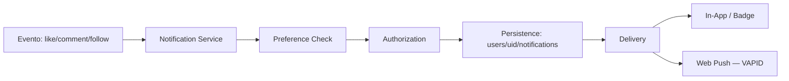

# 13 — NOTIFICATION ARCHITECTURE

> Status do documento: **vivo**.

---

## 1. Pipeline

## 2. Tipos de notificação (`NotificationType`)

| Tipo | Trigger | Hoje |
|---|---|---|
| `like` | `toggleLike` | [IMPLEMENTADO] |
| `comment` / reply | `addComment` | [IMPLEMENTADO] |
| `follow` | `toggleFollow` | [IMPLEMENTADO] |
| `message` | (via mensagens, push) | [PARCIAL] |
| `system` | admin/backend | [PARCIAL] |
| `mention` | — | [NÃO IMPLEMENTADO] |
| `invite` | — | [NÃO IMPLEMENTADO] |
| `security` | alertas de conta | [NÃO IMPLEMENTADO] |

## 3. Fan-out atual

- `src/services/firebase/social.ts` `fanOut()`:
  1. Tenta `POST /api/v1/notify` (backend: grava in-app + dispara Web Push).
  2. Em falha, fallback `pushNotification` direto no Firestore.
- **Nunca quebra a operação principal** (best-effort).

### Backend (`notify.service.ts`)
- `notifyUser(actorUid, input)`:
  - valida (pure function `validateNotifyInput`);
  - rejeita self (`NOTIFY_SELF`);
  - grava `users/{target}/notifications` (`read:false`, `createdAt`);
  - dispara Web Push (best-effort);
  - limpa endpoints mortos (410/404).

## 4. Armazenamento

- `users/{uid}/notifications/{id}` — `{type, actorName, actorAvatar, text, read, createdAt}`.
- Regra: dono + admin leem; update só `read`; delete dono/admin.
- Push subscriptions: `push_subscriptions/{uid}/targets` (backend only, id = sha256 endpoint).

## 5. Preferências

- `users/{uid}.emailNotifications`, `.pushNotifications` (persistidas via `updateAccountProfile`).
- Tela de configuração: `SettingsModule` tab `notifications` (com `getPushStatus/enablePush/disablePush` reais).
- Preferência granular por tipo: `[PLANEJADO]`.

## 6. Realtime (in-app)

- `subscribeToNotifications` (`onSnapshot`) — badge/lista atualiza em tempo real.
- `markAllNotificationsAsRead` (batch).

## 7. Push Web

- `src/services/firebase/push.ts`:
  - `GET /api/v1/meta` → VAPID public key.
  - `pushManager.subscribe({applicationServerKey})`.
  - `POST /api/v1/push/subscribe` registra endpoint.
  - `DELETE /api/v1/push/subscribe` remove.
- `sw.js`: push → `showNotification(title, {body, icon, badge})`; click → focus/`/app`.

## 8. Privacidade e segurança

- Notificações nunca expõem dados sensíveis no corpo do push.
- Self-notification bloqueada.
- Content preview mínimo.

## 9. Escalabilidade

- Fan-out síncrono é **best-effort** e pode perder notificações em escala → **fila assíncrona** recomendada (ver `19-EVENT-DRIVEN-ARCHITECTURE.md`).
- Push massivo (admin) exige backend de fan-out (`AdminNotifications` hoje é read-only; disparo em massa FASE 9).

## 10. Roadmap

1. **[IMPLEMENTADO]** In-app (like/comment/follow) + push Web + preferências + realtime.
2. **[PLANEJADO] P1** — fila de fan-out, notificações de sistema/segurança, agrupamento.
3. **[PLANEJADO] P2** — preferência por tipo, notificações de menção/convite, push mobile (FCM) se houver app.