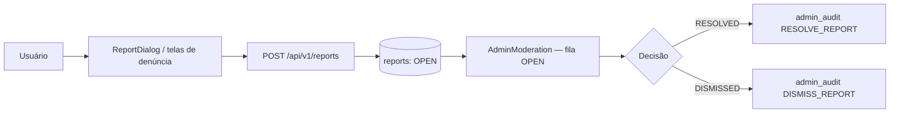
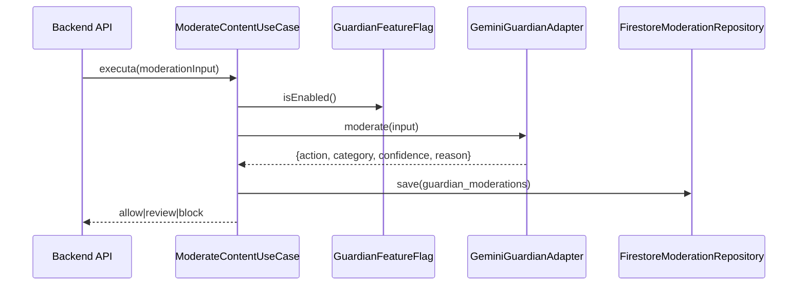

# 15 — MODERATION ARCHITECTURE (Trust & Safety)

> Status do documento: **vivo**.

---

## 1. Modelo de moderação

A FLOW tem **3 camadas** de moderação:

| Camada | Implementação | Estado |
|---|---|---|
| **Comunitária** | Denúncia (`reports`) de posts/perfis/comunidades/mensagens/memorial | [IMPLEMENTADO] |
| **Humana (admin)** | Fila de moderação (`AdminModeration`), resolução/dismiss com auditoria | [IMPLEMENTADO] |
| **Automática (IA)** | Guardian (Gemini via Vertex AI) no backend, off por padrão | [PARCIAL/OPCIONAL] |

## 2. Fluxo de denúncia

## 3. Categorias de denúncia

- `CommerceFoundation.REPORT_CATEGORIES` — 14 categorias (ex.: spam, assédio, discurso de ódio, violação de direitos autorais, violência, privacidade, conteúdo ilegal, etc.).
- Memorial: categorias específicas (`Memorial: {reason}`, `Remoção de memorial: {reason}`).

## 4. Regras e permissões

- `firestore.rules`: `reports` — criação autenticada com `reporterId == uid`; autor lê as próprias; admin lê e altera só `status`.
- `AdminModeration`: guard `['admin','superadmin','moderator']`; resolve/dismiss com auditoria.
- Admin **investiga sem alterar dados originais**: `AdminMessages` é read-only; `AdminContent` pode remover post com auditoria; users são gerenciados por status (não delete).

## 5. Moderação automática — Guardian (backend)

### 5.1 Pipeline

### 5.2 Decisões
| Ação | Comportamento |
|---|---|
| `allow` | post publicado normalmente |
| `review` | `visibility='moderation'` (revisão humana) |
| `block` | HTTP 422 `CONTENT_BLOCKED_BY_GUARDIAN` |

### 5.3 Categorias
`none | harassment | hate | sexual | violence | self_harm | spam | illegal | privacy | other`

### 5.4 Configuração
- `FLOW_GUARDIAN_ENABLED` (default `false`), `FLOW_GUARDIAN_MODEL` (`gemini-2.5-flash`), `FLOW_GUARDIAN_TIMEOUT_MS` (8000).
- Rate limit, schema JSON, validação de resposta (action/category/confidence/reason).

## 6. Evidências e auditoria

- `reports` — registro original (reporterId, targetType, targetId, category, description).
- `guardian_moderations` — input + resultado + `reviewedAt` (backend).
- `admin_audit` — toda ação administrativa de moderação (RESOLVE/DISMISS/REMOVE_POST/VERIFY/...) com `adminUid` real.
- `AdminLogs` / `DeveloperLogs` — trilha legível.

## 7. Recurso (appeal)

- `appeals` — recurso de conta bloqueada/suspensa; criação pública com email válido; decisão via `AdminSuporte` (status only).
- `AccountRestrictionInfo.canAppeal` — exibido nas telas `/conta/bloqueada|suspensa|desativada`.

## 8. Reincidência e políticas

- Reincidência: **não implementada** (histórico existe via `reports` por target, mas sem score). `[PLANEJADO]`
- Políticas: `FLOW_SHOP_POLICY`, `PROHIBITED_PRODUCT_RULES`, `ProductPolicy` (commerce), conteúdo.
- Anti-pirataria: módulo no registro (`antiPiracy`) mas sem backend. `[NÃO IMPLEMENTADO]`

## 9. Requisitos de Trust & Safety

| Requisito | Estado |
|---|---|
| Denúncia (posts/perfis/comunidades/mensagens/memorial) | [IMPLEMENTADO] |
| Bloqueio/silenciamento de usuário | [IMPLEMENTADO] (blocks; mute não) |
| Conteúdo removido visível só p/ admin | [PARCIAL] |
| Revisão humana | [IMPLEMENTADO] |
| Moderação automática | [PARCIAL/OPCIONAL] |
| Evidências | [IMPLEMENTADO] |
| Histórico | [IMPLEMENTADO] |
| Auditoria | [IMPLEMENTADO] |
| Recurso | [IMPLEMENTADO] |
| Reincidência | [NÃO IMPLEMENTADO] |
| Políticas | [PARCIAL] (commerce sim; conteúdo parcial) |

## 10. Roadmap

1. **[IMPLEMENTADO]** Denúncia + fila admin + auditoria + recurso + Guardian opt-in.
2. **[PLANEJADO] P1** — moderar mídia (imagens/vídeos), score de reincidência, mute.
3. **[PLANEJADO] P2** — políticas versionadas, interface de investigação sem alterar dados, relatórios de Trust & Safety.