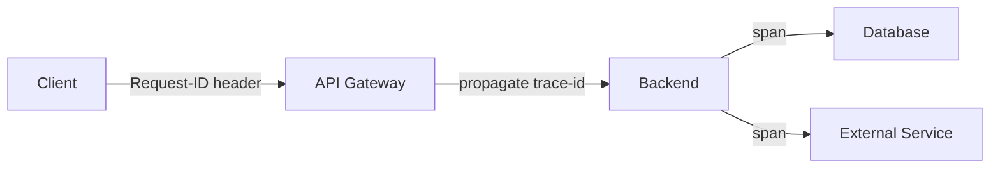

# 18 — OBSERVABILITY

> Status do documento: **vivo**.

---

## 1. Estado atual

| Camada | Ferramenta | Estado |
|---|---|---|
| Logs backend | `request-logger.ts` (JSON estruturado, `x-request-id`) | [IMPLEMENTADO] |
| Métricas backend | `metrics.service.ts` (em memória) | [IMPLEMENTADO] |
| Health check | `GET /health` | [IMPLEMENTADO] |
| Métricas via API | `GET /api/v1/metrics` | [IMPLEMENTADO] |
| Meta/cache stats | `GET /api/v1/meta` | [IMPLEMENTADO] |
| Frontend errors | `AppErrorBoundary` | [IMPLEMENTADO] |
| Frontend runtime notice | `FirebaseRuntimeNotice` | [IMPLEMENTADO] |
| Offline detection | `OfflineNotice` | [IMPLEMENTADO] |
| Analytics | `trackEvent`/`trackPageView` (GA4) | [IMPLEMENTADO] |
| Auditoria admin | `admin_audit` + `AdminLogs` | [IMPLEMENTADO] |
| Traces / OpenTelemetry | — | [NÃO IMPLEMENTADO] |
| Alertas | — | [NÃO IMPLEMENTADO] |

## 2. IDs de correlação

- Backend: `x-request-id` gerado no `request-logger` e incluído nas respostas/logs.
- Frontend: ainda não propaga um ID de sessão para correlacionar com backend. `[PLANEJADO]`

### Fluxo alvo

## 3. Métricas recomendadas

| Grupo | Métrica |
|---|---|
| HTTP | rps, status code, latência (p50/p95/p99), erros |
| Database | tempo de query, contagem de reads/writes, latência |
| Feed | latência de feed, tamanho de página, cache hit rate |
| Search | latência, cache hit |
| Message | latência de envio, entrega push |
| Auth | taxa de login, falhas, bloqueios |
| Queue/Jobs | profundidade, processados, falhas, DLQ |
| Infra | CPU, memória, disco, rede |

## 4. Logs

- Estrutura JSON: `{ ts, level, requestId, route, status, ms, uid?, ... }`.
- Níveis: debug/info/warn/error.
- Sensibilidade: nunca logar PII (email, token, senha, CPF).
- Retenção: definir política.

## 5. Alertas

Sugestões:
- Erros 5xx > threshold em janela.
- Latência p95 > alvo.
- Falha de Guardian.
- Push failures crescentes.
- Fila estagnada.
- Health check falhando.

## 6. OpenTelemetry (alvo)

- Instrumentar backend (Node SDK) com spans para Express/Firestore/Gemini/web-push.
- Exportar para OTLP (Jaeger/Tempo/Grafana Cloud).
- Frontend: `@opentelemetry/instrumentation-fetch` opcional.
- Correlação: propagar `traceparent` do backend para o frontend.

## 7. Plano

1. **[IMPLEMENTADO]** Logs estruturados + health + métricas básicas + auditoria.
2. **[PLANEJADO] P1** — persistir métricas (Redis/Prometheus), alertas, frontend request-id.
3. **[PLANEJADO] P2** — OpenTelemetry + tracing distribuído + dashboards.
4. **[PLANEJADO] P3** — SLI/SLO por área (feed, messaging, search).