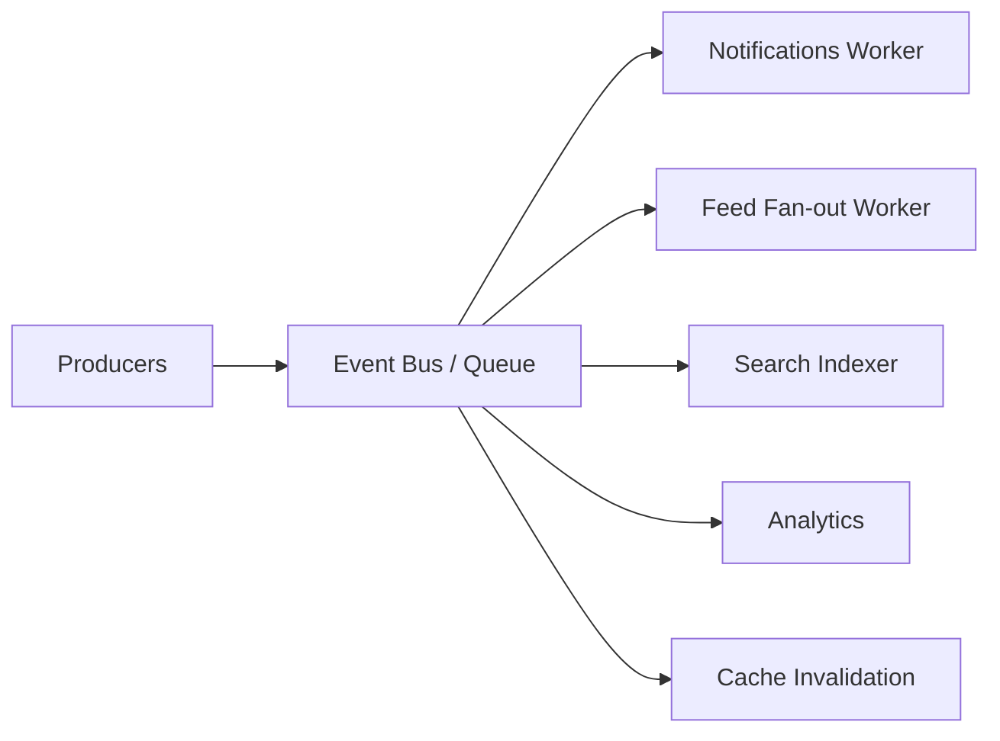

# 19 — EVENT-DRIVEN ARCHITECTURE

> Status do documento: **vivo**. A FLOW ainda é **síncrona** — eventos são mapeados para evolução.

---

## 1. Estado atual

Não há barramento de eventos persistente. O que existe:
- **Fan-out best-effort** de notificações (like/comment/follow) via `POST /api/v1/notify` com fallback Firestore — chamada síncrona que não quebra a operação principal.
- **Scheduler** no backend (publicação de posts agendados, 60s).
- **Auditoria** (`admin_audit`) registrada de forma síncrona.
- Eventos **implícitos**: writes no Firestore (ex.: criação de post) sem emitir evento explícito.

## 2. Eventos de domínio (catálogo)

| Evento | Producer (atual) | Consumidor atual | Consumidor alvo |
|---|---|---|---|
| UserCreated | `auth.registerUser` | — | indexação, analytics |
| UserLoggedIn | `auth.loginUser` | analytics | — |
| PostCreated | `social.createPost` | — | feed fan-out, search index, analytics |
| PostPublished (agendado) | scheduler | — | feed |
| PostLiked | `social.toggleLike` | notify fan-out | notificações, ranking features |
| PostCommented | `social.addComment` | notify fan-out | notificações |
| UserFollowed | `social.toggleFollow` | notify fan-out | feed "seguindo", notificações |
| UserBlocked | `blocks.blockUser` | feed/explore filtro | — |
| CommunityCreated | `communities.createCommunity` | — | — |
| CommunityJoined | `communities.joinCommunity` | memberCount | — |
| MessageSent | `messages.sendMessage` | realtime | push |
| NotificationCreated | notify service | — | push |
| ReportCreated | `submitReport`/`ReportDialog` | admin fila | — |
| AppealCreated | `submitAccountAppeal` | admin fila | — |
| ContractAccepted | `consent.recordUserConsent` | — | — |
| AccountBlocked | admin | — | — |
| MemorialRequestCreated | `memorial.createMemorialRequest` | admin fila | — |
| TributeCreated | `memorial.createTribute` | — | — |

## 3. Arquitetura alvo



### Requisitos do broker
- **Persistence** (não perder eventos): Cloud Tasks / Firestore queue / pub-sub.
- **Retry + backoff**.
- **Dead Letter Queue** para eventos que falham repetidamente.
- **Idempotência** (client-generated id ou chave de evento).
- **Observabilidade** (ver `18-OBSERVABILITY.md`).

## 4. Contrato de evento

```ts
interface FlowEvent<T = unknown> {
  id: string;            // idempotency key
  type: string;          // ex.: 'post.liked'
  producer: string;      // 'web' | 'backend' | 'admin' | 'scheduler'
  aggregateType: string; // 'post' | 'user' | ...
  aggregateId: string;
  actorId?: string;
  occurredAt: string;
  version: number;       // schema version
  data: T;
}
```

## 5. Idempotência e retry

- Chaves: `event.id` (ou hash de `type+aggregateId+occurredAt`).
- Processar com transação de reivindicação (`status: pending → processing → done | failed`).
- DLQ após N tentativas com backoff exponencial.

## 6. Priorização

| Prioridade | Eventos | Infra |
|---|---|---|
| P1 | notificações, feed fan-out, cache invalidation | fila rápida |
| P2 | search index, analytics | fila normal |
| P3 | recomputação de contadores, relatórios | batch |

## 7. Roadmap

1. **[IMPLEMENTADO]** Fan-out síncrono best-effort + scheduler + auditoria síncrona.
2. **[PLANEJADO] P1** — fila de eventos (Cloud Tasks ou Firestore queue) para notificações/feed.
3. **[PLANEJADO] P2** — eventos para search index + analytics + cache.
4. **[PLANEJADO] P3** — outbox pattern (event sourcing para mudanças de estado críticas).