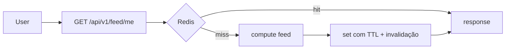

# 20 — CACHE ARCHITECTURE

> Status do documento: **vivo**. Regra: **nunca cachear dados privados de forma insegura.**

---

## 1. Camadas atuais

| Camada | Implementação | Estado |
|---|---|---|
| Browser cache | HTTP cache + Vite assets (fingerprint) | [IMPLEMENTADO] |
| PWA cache | Service Worker `flow-shell-v3` (app-shell network-first) | [IMPLEMENTADO] |
| CDN | Vercel edge cache (estático) | [IMPLEMENTADO] |
| Application cache | Backend `cache.service.ts` (em memória, TTL) | [IMPLEMENTADO] |
| Redis | — | [NÃO IMPLEMENTADO] |
| Database cache | Firestore índice (gerenciado) | [IMPLEMENTADO] |

## 2. Backend cache (`cache.service.ts`)

- `cacheGet<T>(key)`, `cacheSet(key, value, ttlMs)`, `cacheInvalidate(prefix)`, `cacheStats()`.
- Usos: `/api/v1/meta` (60s), `/api/v1/feed` (15s).
- **Process-local**: perde em restart e não serve múltiplas instâncias. `[PARCIAL]`

## 3. Cache de feed (alvo)

- **Chave:** `feed:{userId}:{mode}:{cursor}`.
- **TTL:** 15–60s (curto para manter frescor).
- **Invalidation:** por evento (`post.created`, `user.followed`, `user.blocked`) — via `cacheInvalidate(prefix)`.
- **Stampede:** lock/leitura única (single-flight) para evitar recálculo em massa.
- **Fallback:** cache vazio → cronológico.

## 4. Políticas por tipo de dado

| Dado | Cacheável? | TTL | Privacidade |
|---|---|---|---|
| Posts públicos | sim (anônimo ok) | curto | público |
| Feed por usuário | sim | curto | **privado** — chave por usuário |
| Comunidades populares | sim | médio | público |
| Contadores | sim | médio | — |
| Perfil público | sim | curto | público |
| Perfil privado/dados | **não** | — | privado |
| Mensagens | não (realtime) | — | privado |
| Notificações | não (realtime) | — | privado |
| Settings | sim | curto | privado |
| Meta/rotas | sim | 60s | público |

## 5. Cache Stampede

Mitigações:
- Single-flight por chave.
- Jitter no TTL.
- Stale-while-revalidate (retornar dado antigo e revalidar em background).

## 6. Consistência

- Cache de leitura sempre validado contra regras de autorização no servidor.
- Invalidação por prefixo quando entidades mudam.
- Nunca cachear resposta com dados privados de outro usuário.

## 7. Roadmap

1. **[IMPLEMENTADO]** SW app-shell + backend TTL cache + browser caching.
2. **[PLANEJADO] P1** — Redis (Upstash/Redis Cloud) substituindo cache em memória; cache de feed/ranking.
3. **[PLANEJADO] P2** — cache de perfis/queries quentes; single-flight; stale-while-revalidate.
4. **[PLANEJADO] P3** — CDN para mídia (já via Storage), edge cache para público.