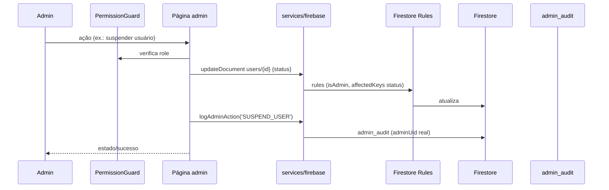

# 22 — ADMIN ARCHITECTURE

> Status do documento: **vivo**. Baseado em `src/admin/`.

---

## 1. Visão geral

O painel administrativo (`/admin`) é uma SPA própria com:
- **Auth**: `AdminAuthContext` (Firebase Auth + role `admin`/`moderator`; nega não-admin).
- **Shell**: `AdminShell` (topbar, sidebar, footer com health do backend).
- **Guard**: `PermissionGuard` por rota (UX) + Firestore Rules/`requireAdmin` (proteção real).
- **Rotas**: `AdminApp.tsx` resolve `/admin/*` → página.

## 2. Módulos e permissões

| Página | Rota (admin) | Roles | Coleções | Ações |
|---|---|---|---|---|
| Dashboard | `/admin` | todos admins | users, posts, communities, reports, admin_audit | KPIs reais |
| Usuários | `/admin/usuarios` | admin, superadmin | users | suspender/reativar/verify |
| Conteúdo | `/admin/conteudo` | admin, superadmin, moderator | posts | remover post |
| Moderação | `/admin/moderacao` | admin, superadmin, moderator | reports | resolver/dismiss |
| Comunidades | `/admin/comunidades` | admin, superadmin, moderator | communities | verify/archive |
| Mensagens | `/admin/mensagens` | admin, superadmin, moderator | conversations, messages | leitura (auditoria) |
| Notificações | `/admin/notificacoes` | admin, superadmin, moderator | notifications (collectionGroup) | leitura |
| Memorial | `/admin/memorial` | admin, superadmin, moderator | memorial_requests | aprovar/rejeitar |
| RH | `/admin/rh` | admin, superadmin | users | role management |
| Marketplace | `/admin/marketplace` | admin | — | **pendente Fase 9** |
| Eventos | `/admin/eventos` | admin | — | **pendente Fase 9** |
| Analytics | `/admin/analytics` | todos admins | users, posts, communities, reports | KPIs + CSV |
| Relatórios | `/admin/relatorios` | todos admins | users, posts, communities, reports, admin_audit, memorial_requests | CSV export |
| Configurações | `/admin/configuracoes` | admin, superadmin | platform_settings/global | settings |
| Segurança | `/admin/seguranca` | todos admins | firebaseDiagnostics | diagnóstico (parcial static) |
| Sistema | `/admin/sistema` | todos admins | probes (users/posts/...) | health |
| Logs | `/admin/logs` | admin, superadmin | admin_audit | trilha |
| Suporte | `/admin/suporte` | admin, superadmin, moderator | appeals | resolve/reject |
| Módulos | `/admin/modulos` | admin, superadmin | platform_settings/modules | feature flags |
| Site | `/admin/site` | admin, superadmin | site_pages | editor de blocos |

## 3. Fluxo típico de ação admin

## 4. Auditoria (`admin_audit`)

- `logAdminAction(action, target, details?)` — `{adminUid, adminEmail, action, target, details, createdAt}`.
- Ações: `SUSPEND_USER, REACTIVATE_USER, VERIFY_USER, UNVERIFY_USER, CHANGE_USER_ROLE, REMOVE_POST, RESOLVE_REPORT, DISMISS_REPORT, VERIFY_COMMUNITY, UNVERIFY_COMMUNITY, ARCHIVE_COMMUNITY, UNARCHIVE_COMMUNITY, APPROVE_MEMORIAL, REJECT_MEMORIAL, RESOLVE_APPEAL, REJECT_APPEAL, PUBLISH_SITE_PAGE, MODULE_MAINTENANCE, MODULE_ENABLE`.
- Leitura: `AdminLogs`, `DeveloperLogs`.

## 5. Feature flags (ModuleCenter)

- 16 módulos toggled `enabled`/`maintenance` (UI também mostra `disabled`).
- Persistência real em `platform_settings/modules`.
- Auditoria em `admin_audit`.
- Aplicação no app via `ModuleGate` (bloqueia `maintenance`).

## 6. SiteEditor

- Editor de blocos por página (`site_pages/{pageDocId}`).
- Páginas: `/`, `/for-you`, `/explorar`, `/recursos`, `/criadores`, `/comunidades`, `/seguranca`, `/empresa`, `/sobre`, `/carreiras`, `/imprensa`, `/blog`, `/contato`, `/parcerias`, `/marcas`, `/media-kit`, `/ajuda`, `/acessibilidade`.
- Vinculação viva com a Home: **Fase 9** `[PARCIAL]`.

## 7. Estática vs real no admin

| Área | Estado |
|---|---|
| Dashboard/Usuários/Conteúdo/Moderação/Comunidades/Mensagens/Memorial/RH/Logs/Suporte/Relatórios/Analytics/Sistema/Módulos/Site | [IMPLEMENTADO] — dados reais |
| Marketplace / Eventos | [NÃO IMPLEMENTADO] — placeholder honesto |
| Topbar notificações (dropdown, badge "3") | [PARCIAL] — mock |
| AdminSecurity (policy rows estáticas) | [PARCIAL] — diagnóstico real, labels estáticos |
| AdminLogin quick-demo creds | [PARCIAL] — conveniência |

## 8. Segurança

- `superadmin` nos guards mas inalcançável na prática `[PARCIAL]`.
- Admin nunca deleta usuário/conversa (rules: delete false).
- AdminMessages é read-only.
- Auditoria obrigatória em ações destrutivas.

## 9. Roadmap

1. **[IMPLEMENTADO]** Admin real (RBAC, auditoria, fila de moderação, feature flags, site editor, health).
2. **[PLANEJADO] P1** — marketplace/eventos admin, notificações em massa (fan-out backend), séries históricas de analytics.
3. **[PLANEJADO] P2** — relatórios avançados, gestão de integrações, central de compliance.