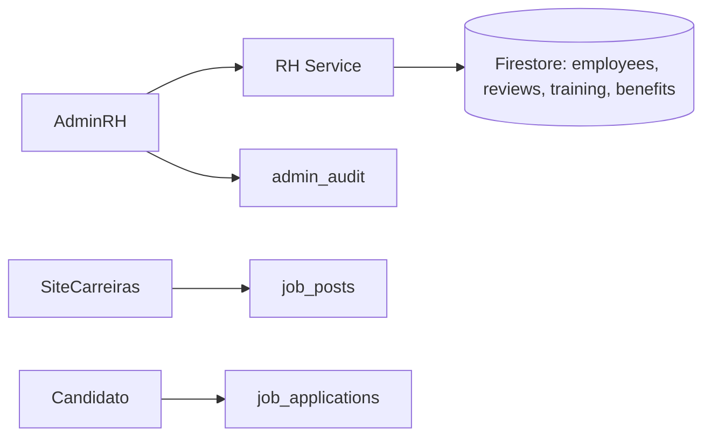

# 23 — RH ARCHITECTURE

> Status do documento: **vivo**.

---

## 1. O que existe

- **`AdminRH`** (`/admin/rh`): diretório real de colaboradores (`users`, max 200) + gestão de **role** (`user | creator | seller | moderator | admin`) com auditoria (`CHANGE_USER_ROLE`).
- **Recrutamento público**: `SiteCarreiras` (`/carreiras`) — vagas reais (`job_posts`), detalhe e candidatura (`job_applications`, exige login).
- **Admin de vagas/candidaturas**: `job_posts` (admin cria/edita), `job_applications` (admin lê).
- Regras: vagas públicas; candidaturas autenticadas; admin tria.

## 2. O que NÃO existe (marcado como pendente no próprio código)

`AdminRH` declara explicitamente: *"Recrutamento, desempenho, treinamentos e benefícios exigem backend próprio: PENDENTES documentados (sem telas fictícias)."*

| Capacidade | Estado |
|---|---|
| Recrutamento (vagas/candidaturas) | [IMPLEMENTADO] (básico real) |
| Gestão de roles | [IMPLEMENTADO] |
| Avaliação de desempenho | [NÃO IMPLEMENTADO] |
| Treinamentos | [NÃO IMPLEMENTADO] |
| Benefícios | [NÃO IMPLEMENTADO] |
| Folha/remuneração | [NÃO IMPLEMENTADO] |
| Gestão de equipe/estrutura | [NÃO IMPLEMENTADO] |

## 3. Arquitetura alvo

- Recomendações: módulo RH **separado** (dados sensíveis de funcionários nunca misturados com dados sociais), acesso só `admin/superadmin`, auditoria total.
- LGPD: dados de colaboradores têm classificação sensível.

## 4. Roadmap

1. **[IMPLEMENTADO]** Diretório + roles + vagas/candidaturas + auditoria.
2. **[PLANEJADO] P1** — backend RH dedicado (ex.: Postgres), gestão de candidaturas (triagem/status), contratos.
3. **[PLANEJADO] P2** — desempenho, treinamentos, benefícios, integração com folha.