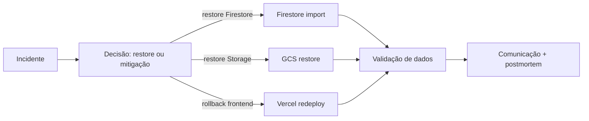

# 28 — DISASTER RECOVERY

> Status do documento: **vivo**. Estratégia de backup, restauração e continuidade.

---

## 1. Estado atual

| Aspecto | Estado |
|---|---|
| Backup do Firestore | `[NÃO IMPLEMENTADO]` — depende da plataforma (Firestore export/import) |
| Backup do Storage | `[NÃO IMPLEMENTADO]` |
| Restore | `[NÃO IMPLEMENTADO]` |
| Replicação | Firebase gerencia disponibilidade multi-região (padrão) |
| Failover | manual |
| Incident response | `[PLANEJADO]` (ver `34-INCIDENT-RESPONSE.md`) |
| Rollback de deploy | Vercel (frontend) — instantâneo por deploy anterior |
| Data recovery | Storage audit (`storage-audit`) para órfãos |

## 2. Métricas alvo (RPO/RTO)

| Item | RPO alvo | RTO alvo |
|---|---|---|
| Firestore | ≤ 1h (export diário + PITR) | ≤ 4h |
| Storage | ≤ 24h | ≤ 24h |
| Frontend (Vercel) | instantâneo (deploy) | minutos |
| Backend | stateless; restart | minutos |

## 3. Plano de backup

### 3.1 Firestore
- Usar **Firestore export/import** (Cloud Scheduler → Cloud Functions/Admin) diário para bucket GCS.
- Considerar **PITR (point-in-time recovery)** do Firestore nativo.
- Guardar exports versionados com retenção.

### 3.2 Storage
- Versionamento do bucket (GCS) + backup dos metadados.
- Auditoria de órfãos periódica (`storage-audit`).

### 3.3 Config
- `firestore.rules`, `firestore.indexes.json`, `.env.example` versionados (git).
- Segredos em gerenciador de segredos (Secret Manager) — `[PLANEJADO]`.

## 4. Plano de restore

## 5. Failover

- Frontend: Vercel (CDN global).
- Backend: stateless → subir nova instância; Redis externo (quando implementado) multi-AZ.
- Firebase: gerenciado.

## 6. Incident response

- Procedimento em `34-INCIDENT-RESPONSE.md`.
- Contatos, severidades, comunicação, postmortem.

## 7. Testes (DR drills)

- Trimestral: restaurar export de Firestore em projeto staging e validar contagem/regras.
- Testar rollback de deploy.
- Testar boot do backend sem segredos (falha rápida clara).

## 8. Roadmap

1. **[IMPLEMENTADO]** Versionamento de rules/indexes/env, audit de órfãos, rollback de deploy.
2. **[PLANEJADO] P1** — export diário do Firestore (scheduler), versionamento do Storage, runbook.
3. **[PLANEJADO] P2** — PITR, backup de segredos, DR drills trimestrais.
4. **[PLANEJADO] P3** — multi-região backend + replicação.