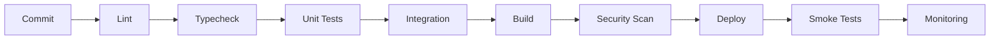

# 29 — CI/CD

> Status do documento: **vivo**. Baseado em `.github/workflows/`.

---

## 1. Pipelines existentes

### 1.1 `ci.yml` (frontend + backend)
```
push/PR → jobs:
  frontend:
    - pnpm install
    - pnpm lint / typecheck (tsc -b)
    - pnpm test (vitest)
    - pnpm build (vite build)
  backend:
    - npm install (backend)
    - npm test (tsx tests/domain.test.ts)
    - npm run build (tsc)
```

### 1.2 `playwright.yml` (E2E)
```
push/PR → job:
  - instala deps + browsers
  - pnpm dev (webServer localhost:3000)
  - pnpm exec playwright test
  - artefato: html report
```

## 2. Pipeline alvo



## 3. Gaps

| Etapa | Estado |
|---|---|
| Lint/typecheck | ✔ |
| Unit tests | ✔ (parcial — ver `24-TESTING-STRATEGY.md`) |
| Integration (emulador Firebase) | ✘ |
| Build | ✔ |
| Security scan | ✘ (ex.: `npm audit`, SAST) |
| Deploy automatizado | frontend via Vercel (git), backend ✘ |
| Smoke pós-deploy | Playwright |
| Monitoring alert | ✘ |

## 4. Recomendações

1. **Adicionar** `npm audit`/`pnpm audit` + SAST (CodeQL) no CI.
2. **Emulador Firebase** no CI para testes de integração/regras.
3. **Deploy do backend** (Cloud Run/Render/Fly) com health check.
4. **Gates**: impedir merge se build/test falhar; placeholder de API key no CI deve falhar.
5. **Secret scanning** no CI.
6. **Versionamento** semântico de releases + changelog.

## 5. Roadmap

1. **[IMPLEMENTADO]** CI frontend+backend, E2E, build gate.
2. **[PLANEJADO] P1** — audit de dependências, emulador Firebase, deploy backend.
3. **[PLANEJADO] P2** — security scan, smoke pós-deploy, monitoring alerts.
4. **[PLANEJADO] P3** — feature flags + canary, rollback automatizado.