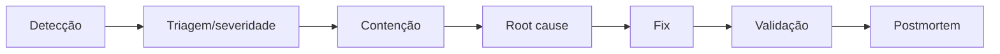

# 34 — INCIDENT RESPONSE

> Status do documento: **vivo**. Runbook inicial. Ver também `28-DISASTER-RECOVERY.md`.

---

## 1. Severidades

| Nível | Definição | Exemplo | SLA de resposta |
|---|---|---|---|
| SEV-1 | Indisponibilidade total / vazamento | site fora, dados expostos | 15 min |
| SEV-2 | Degradação grave | feed lento, push falhando | 1 h |
| SEV-3 | Degradação local | módulo em manutenção | 4 h |
| SEV-4 | Baixo impacto | bug visual | 1 dia |

## 2. Fluxo

## 3. Detecção

- Health check (`/health`).
- `AdminSistema` (dashboards de sistema).
- `AdminDashboard` (KPIs).
- Monitoramento planejado (alertas em `18-OBSERVABILITY.md`).

## 4. Contenção típica

| Cenário | Contenção |
|---|---|
| Backend fora | reiniciar/redeply; ativar modo manutenção de módulos (`ModuleCenter`) |
| Firebase config errada | corrigir env; rollback de env |
| Feed lento | cache TTL menor; kill switch de ranking |
| Conteúdo abusivo | `AdminModeration` resolve/remove; suspender usuário; Guardian on |
| Vazamento de dados | bloquear acesso, revogar, notificar conforme LGPD |

## 5. Comunicação

- Canal de incidente (slack/email).
- Aviso público quando aplicável.
- LGPD: notificação de incidente com dados pessoais à ANPD/afetados `[PLANEJADO]`.

## 6. Postmortem

- Timeline, root cause, impacto, ações corretivas, owner, prazo.
- Rastreabilidade via `admin_audit` e logs.

## 7. Time e escalonamento

- Contato: time de engenharia (definir), `AdminSuporte` para appeals.
- Escalonamento: suporte → engenharia → liderança (SEV-1/2).

## 8. Roadmap

1. **[IMPLEMENTADO]** Health, dashboards, manutenção de módulos, auditoria.
2. **[PLANEJADO] P1** — alertas automatizados, runbook publicado, contact list.
3. **[PLANEJADO] P2** — on-call, SLA tracking, notificação LGPD automatizada.